<p align="center">
  
  
  
  
</p>

<div align="center">

#  kindling

**Push code. Your laptop builds it. Your laptop runs it. Zero cloud CI minutes.**

[](https://kindling-sh.github.io/kindling/)
[](https://github.com/kindling-sh/kindling/releases/latest)
[](https://github.com/kindling-sh/homebrew-tap)

</div>

`kindling` is a Kubernetes operator that turns every developer's local [Kind](https://kind.sigs.k8s.io/) cluster into a personal, self-hosted GitHub Actions CI/CD environment. When you push to GitHub, the CI job is routed *back to your own machine*, where it builds the app container and deploys an ephemeral staging environment — all in seconds, all on localhost.

---

## Why?

Most teams pay for cloud CI runners that:

- 🐢 Queue behind other jobs
- 💸 Burn money on compute you already have under your desk
- 🔄 Build artifacts you then have to pull back down to test locally

**What if the runner was already on your laptop?**

`kindling` flips the model. Each developer runs a lightweight Kind cluster. Inside it, a self-hosted GitHub Actions runner polls for CI jobs triggered by *their* pushes. When a job arrives, the runner builds containers using **Kaniko** (no Docker daemon required) and pushes them to an **in-cluster registry**. The operator then deploys the result as a full staging environment — Deployment, Service, Ingress, and up to 15 types of auto-provisioned dependencies — right on localhost.

```mermaid
%%{init: {'theme': 'dark'}}%%
flowchart TB
    dev("👩‍💻 Developer\n<i>git push</i>")
    gh("🐙 GitHub.com\nActions")

    dev -- "git push" --> gh
    gh -- "runs-on: self-hosted" --> runner

    subgraph machine["🖥️  Developer's Machine"]
        subgraph kind["☸  Kind Cluster"]
            controller("🔥 kindling\ncontroller")
            runner("🏃 Runner Pod\n<i>runner + build-agent sidecar</i>")
            registry("📦 registry:5000\n<i>in-cluster</i>")
            staging("⎈ DevStagingEnv\n<i>Deployment + Service + Ingress</i>")

            runner -- "Kaniko build" --> registry
            registry -- "image pull" --> staging
            controller -- "creates &\nreconciles" --> staging
            runner -- "applies CR" --> controller
        end
    end

    staging -. "localhost:80\n(via Ingress)" .-> dev

    style machine fill:#1a1a2e,stroke:#FF6B35,color:#e0e0e0,stroke-width:2px
    style kind fill:#0f3460,stroke:#326CE5,color:#e0e0e0,stroke-width:2px
    style controller fill:#FF6B35,stroke:#FF6B35,color:#fff
    style runner fill:#2ea043,stroke:#2ea043,color:#fff
    style registry fill:#F7931E,stroke:#F7931E,color:#fff
    style staging fill:#326CE5,stroke:#326CE5,color:#fff
    style dev fill:#6e40c9,stroke:#6e40c9,color:#fff
    style gh fill:#24292f,stroke:#e0e0e0,color:#fff
```



---

## Custom Resources

The operator manages two CRDs in the `apps.example.com/v1alpha1` group:

### `GithubActionRunnerPool`

Declares a self-hosted runner pool bound to a **single developer** and a **single GitHub repository**. The operator creates a Deployment with two containers:

1. **Runner** — the [official GitHub Actions runner image](https://github.com/actions/runner). Exchanges the stored PAT for a short-lived registration token at startup, registers with GitHub using the developer's username as a label, and cleanly de-registers on shutdown.
2. **Build-agent sidecar** — a `bitnami/kubectl` container that watches a shared `/builds` volume for build and deploy requests. It runs Kaniko pods for image builds and `kubectl apply` for deployments, keeping the runner container stock and unprivileged.

The operator also **auto-provisions RBAC** (ServiceAccount, ClusterRole, ClusterRoleBinding) for each runner pool — no manual SA setup required.

```yaml
apiVersion: apps.example.com/v1alpha1
kind: GithubActionRunnerPool
metadata:
  name: jeff-runner-pool
spec:
  githubUsername: "jeff-vincent"
  repository: "jeff-vincent/demo-kindling"
  tokenSecretRef:
    name: github-runner-token
  replicas: 1
  labels: [linux]
  resources:
    cpuRequest: "500m"
    memoryLimit: "4Gi"
```

<details>
<summary><strong>Full GithubActionRunnerPool spec reference</strong></summary>

| Field | Default | Description |
|---|---|---|
| `githubUsername` | *(required)* | Developer's GitHub handle — auto-added as a runner label |
| `repository` | *(required)* | GitHub repo slug (`org/repo`) |
| `tokenSecretRef` | *(required)* | Reference to a Secret holding a GitHub PAT (`repo` scope) |
| `replicas` | `1` | Number of runner pods |
| `runnerImage` | `ghcr.io/actions/actions-runner:latest` | Runner container image |
| `labels` | `[]` | Extra runner labels (`self-hosted` + username always added) |
| `runnerGroup` | `"Default"` | GitHub runner group |
| `resources` | `nil` | CPU/memory requests and limits |
| `serviceAccountName` | `""` | SA for the runner pod (auto-created if empty) |
| `workDir` | `/home/runner/_work` | Runner working directory |
| `githubURL` | `https://github.com` | Override for GitHub Enterprise Server |
| `env` | `[]` | Extra environment variables |
| `volumeMounts` | `[]` | Additional volume mounts |
| `volumes` | `[]` | Additional volumes |

</details>

### How the build-agent sidecar works

The runner pod contains two containers sharing a `/builds` emptyDir volume:

```
┌─────────────────────────────────────────────────────────┐
│ Runner Pod                                              │
│                                                         │
│  ┌─────────────────┐   /builds   ┌───────────────────┐  │
│  │ runner           │◄──────────►│ build-agent        │  │
│  │ (GH Actions)     │  emptyDir  │ (bitnami/kubectl)  │  │
│  │                  │            │                    │  │
│  │ writes:          │            │ watches for:       │  │
│  │  *.tar.gz + .dest│            │  .request → Kaniko │  │
│  │  *.yaml          │            │  .apply   → apply  │  │
│  │  *.sh            │            │  .kubectl → exec   │  │
│  └─────────────────┘            └───────────────────┘  │
└─────────────────────────────────────────────────────────┘
```

| Trigger file | What the sidecar does | Signal when done |
|---|---|---|
| `<name>.request` | Reads `<name>.tar.gz` + `<name>.dest`, pipes into a one-shot Kaniko pod | `<name>.done` |
| `<name>.apply` | Runs `kubectl apply -f <name>.yaml` | `<name>.apply-done` |
| `<name>.kubectl` | Runs `bash <name>.sh` (arbitrary kubectl scripts) | `<name>.kubectl-done` |

### `DevStagingEnvironment`

Declares a complete ephemeral staging environment: a **Deployment**, a **Service**, an optional **Ingress**, and zero or more **Dependencies**. The operator auto-provisions each dependency and injects connection env vars into the app container — no manual wiring required.

```yaml
apiVersion: apps.example.com/v1alpha1
kind: DevStagingEnvironment
metadata:
  name: jeff-dev
spec:
  deployment:
    image: registry:5000/myapp:jeff-abc123
    replicas: 1
    port: 8080
    healthCheck:
      path: /healthz
  service:
    port: 8080
    type: ClusterIP
  ingress:
    enabled: true
    host: jeff-dev.localhost
    ingressClassName: nginx
  dependencies:
    - type: postgres
      version: "16"
    - type: redis
```

#### Supported dependency types (15)

| Type | Default Image | Port | Injected Env Var | Notes |
|---|---|---|---|---|
| `postgres` | `postgres:16` | 5432 | `DATABASE_URL` | Auto-creates `devdb` with user `devuser` |
| `redis` | `redis:latest` | 6379 | `REDIS_URL` | Stateless, no persistence |
| `mysql` | `mysql:latest` | 3306 | `DATABASE_URL` | Auto-creates `devdb` with user `devuser` |
| `mongodb` | `mongo:latest` | 27017 | `MONGO_URL` | Root user `devuser` |
| `rabbitmq` | `rabbitmq:3-management` | 5672 | `AMQP_URL` | Includes management UI |
| `minio` | `minio/minio:latest` | 9000 | `S3_ENDPOINT` | Also injects `S3_ACCESS_KEY` + `S3_SECRET_KEY` |
| `elasticsearch` | `docker.elastic.co/.../elasticsearch` | 9200 | `ELASTICSEARCH_URL` | Single-node, security disabled |
| `kafka` | `apache/kafka:latest` | 9092 | `KAFKA_BROKER_URL` | KRaft mode (no ZooKeeper) |
| `nats` | `nats:latest` | 4222 | `NATS_URL` | Lightweight messaging |
| `memcached` | `memcached:latest` | 11211 | `MEMCACHED_URL` | In-memory cache |
| `cassandra` | `cassandra:latest` | 9042 | `CASSANDRA_URL` | Single-node dev cluster |
| `consul` | `hashicorp/consul:latest` | 8500 | `CONSUL_HTTP_ADDR` | Service mesh / KV store |
| `vault` | `hashicorp/vault:latest` | 8200 | `VAULT_ADDR` | Dev mode, also injects `VAULT_TOKEN` |
| `influxdb` | `influxdb:latest` | 8086 | `INFLUXDB_URL` | Time-series database |
| `jaeger` | `jaegertracing/all-in-one:latest` | 16686 | `JAEGER_ENDPOINT` | Distributed tracing UI |

Every dependency's env var name can be overridden via `dependencies[].envVarName`.

<details>
<summary><strong>Full DevStagingEnvironment spec reference</strong></summary>

| Field | Default | Description |
|---|---|---|
| `deployment.image` | *(required)* | Container image to run |
| `deployment.port` | *(required)* | Container port |
| `deployment.replicas` | `1` | Pod replica count |
| `deployment.command` | `[]` | Override container entrypoint |
| `deployment.args` | `[]` | Entrypoint arguments |
| `deployment.env` | `[]` | Environment variables |
| `deployment.resources` | `nil` | CPU/memory requests and limits |
| `deployment.healthCheck.path` | `/healthz` | HTTP health check path |
| `deployment.healthCheck.initialDelaySeconds` | `5` | Delay before first probe |
| `deployment.healthCheck.periodSeconds` | `10` | Probe interval |
| `service.port` | *(required)* | Service port |
| `service.targetPort` | container port | Target port on the pod |
| `service.type` | `ClusterIP` | `ClusterIP` / `NodePort` / `LoadBalancer` |
| `ingress.enabled` | `false` | Create an Ingress resource |
| `ingress.host` | `""` | Hostname for the Ingress rule |
| `ingress.path` | `/` | URL path prefix |
| `ingress.pathType` | `Prefix` | `Prefix` / `Exact` / `ImplementationSpecific` |
| `ingress.ingressClassName` | `nil` | Ingress class (e.g. `nginx`) |
| `ingress.tls` | `nil` | TLS termination config |
| `ingress.annotations` | `{}` | Extra Ingress annotations |
| `dependencies[].type` | *(required)* | One of the 15 supported types above |
| `dependencies[].version` | latest | Image tag (e.g. `"16"`, `"7.2"`) |
| `dependencies[].image` | per-type default | Override the container image entirely |
| `dependencies[].port` | per-type default | Override the service port |
| `dependencies[].env` | `[]` | Extra/override env vars for the dependency container |
| `dependencies[].envVarName` | per-type default | Override the injected env var name |
| `dependencies[].storageSize` | `1Gi` | PVC size for stateful dependencies |
| `dependencies[].resources` | `nil` | CPU/memory requests and limits |

</details>

---

## Reusable GitHub Actions

kindling ships two **composite actions** that eliminate workflow boilerplate. Any repo can use them:

### `kindling-build`

Builds a container image via the Kaniko sidecar. Replaces ~15 lines of signal-file scripting with a single step.

> **⚠️ Dockerfile required:** `kindling-build` runs the Dockerfile found in the build context directory as-is using Kaniko. It does **not** generate or modify Dockerfiles. Each service must have a working Dockerfile that builds successfully on its own (e.g. `docker build .`) — if it doesn't build locally, it won't build in kindling.

```yaml
- uses: kindling-sh/kindling/.github/actions/kindling-build@main
  with:
    name: my-app                              # unique build name
    context: ${{ github.workspace }}           # build context path
    image: "registry:5000/my-app:${{ env.TAG }}"  # destination image
    dockerfile: "Dockerfile"                   # optional: Dockerfile path relative to context
    exclude: "./tests"                         # optional tar --exclude
    timeout: "300"                             # optional build timeout (seconds)
```

### `kindling-deploy`

Generates and applies a `DevStagingEnvironment` CR. Replaces ~30 lines of YAML-generation + sidecar scripting with declarative inputs.

```yaml
- uses: kindling-sh/kindling/.github/actions/kindling-deploy@main
  with:
    name: "${{ github.actor }}-my-app"
    image: "registry:5000/my-app:${{ env.TAG }}"
    port: "8080"
    labels: |
      app.kubernetes.io/part-of: my-app
    ingress-host: "${{ github.actor }}-my-app.localhost"
    dependencies: |
      - type: postgres
        version: "16"
      - type: redis
```

<details>
<summary><strong>Full kindling-deploy input reference</strong></summary>

| Input | Required | Default | Description |
|---|---|---|---|
| `name` | ✅ | | DSE metadata.name |
| `image` | ✅ | | Container image reference |
| `port` | ✅ | | Container port |
| `labels` | | `""` | Extra labels (YAML block) |
| `env` | | `""` | Extra env vars (YAML block) |
| `dependencies` | | `""` | Dependencies (YAML block) |
| `ingress-host` | | `""` | Ingress hostname |
| `ingress-class` | | `nginx` | Ingress class name |
| `health-check-path` | | `/healthz` | HTTP health check path |
| `replicas` | | `1` | Pod replica count |
| `service-type` | | `ClusterIP` | Service type |
| `wait` | | `true` | Wait for deployment rollout |
| `wait-timeout` | | `180s` | Rollout timeout |

</details>

---

## Installation

### Pre-built binaries (recommended)

Download the latest release for your platform from [GitHub Releases](https://github.com/kindling-sh/kindling/releases):

```bash
# macOS (Apple Silicon)
curl -Lo kindling.tar.gz https://github.com/kindling-sh/kindling/releases/latest/download/kindling_$(curl -s https://api.github.com/repos/kindling-sh/kindling/releases/latest | grep tag_name | cut -d '"' -f4 | sed 's/^v//')_darwin_arm64.tar.gz
tar xzf kindling.tar.gz
sudo mv kindling /usr/local/bin/

# macOS (Intel)
curl -Lo kindling.tar.gz https://github.com/kindling-sh/kindling/releases/latest/download/kindling_$(curl -s https://api.github.com/repos/kindling-sh/kindling/releases/latest | grep tag_name | cut -d '"' -f4 | sed 's/^v//')_darwin_amd64.tar.gz
tar xzf kindling.tar.gz
sudo mv kindling /usr/local/bin/

# Linux (amd64)
curl -Lo kindling.tar.gz https://github.com/kindling-sh/kindling/releases/latest/download/kindling_$(curl -s https://api.github.com/repos/kindling-sh/kindling/releases/latest | grep tag_name | cut -d '"' -f4 | sed 's/^v//')_linux_amd64.tar.gz
tar xzf kindling.tar.gz
sudo mv kindling /usr/local/bin/
```

> **macOS Gatekeeper note:** If you see *"Apple could not verify kindling is free of malware"*, clear the quarantine flag:
> ```bash
> sudo xattr -d com.apple.quarantine /usr/local/bin/kindling
> ```

Verify the installation:

```bash
kindling version
```

### Build from source

Requires Go 1.25+:

```bash
git clone https://github.com/kindling-sh/kindling.git
cd kindling
make cli
sudo mv bin/kindling /usr/local/bin/
```

---

## Getting Started

### Prerequisites

| Tool | Version |
|---|---|
| [Kind](https://kind.sigs.k8s.io/) | 0.20+ |
| [kubectl](https://kubernetes.io/docs/tasks/tools/) | 1.28+ |
| [Docker](https://docs.docker.com/get-docker/) | 24+ (for building the operator image only — app images use Kaniko) |
| [Go](https://go.dev/dl/) | 1.25+ (only needed if building from source) |

### Recommended Docker Desktop resources

Kindling runs a full Kubernetes cluster inside Docker via Kind. Before
bootstrapping, allocate enough resources in **Docker Desktop → Settings →
Resources**:

| Workload | CPUs | Memory | Disk |
|---|---|---|---|
| Small (1–3 lightweight services) | 4 | 8 GB | 30 GB |
| Medium (4–6 services, mixed languages) | 6 | 12 GB | 50 GB |
| Large (7+ services, heavy compilers like Rust/Java/C#) | 8+ | 16 GB | 80 GB |

The default Kind config uses a single control-plane node — this is intentional.
Adding worker nodes doesn't help in a local context and just splits available
memory. Kaniko layer caching is enabled (`registry:5000/cache`), so first builds
are slow but subsequent rebuilds are fast. Make sure you have enough disk for the
cache — heavy stacks can use 2–5 GB of cached layers per service.

### Option A: Use the CLI (recommended)

The `kindling` CLI wraps the entire bootstrap flow into simple commands:

```bash
# Bootstrap everything: Kind cluster + ingress + registry + operator
kindling init

# With optional Kind flags
kindling init --image kindest/node:v1.29.0 --wait 60s

# Register a self-hosted GitHub Actions runner
kindling runners -u <github-user> -r <owner/repo> -t <pat>

# AI-generate a GitHub Actions workflow for your repo
kindling generate -k <api-key> -r /path/to/my-app

# Manage external secrets (API keys, tokens, DSNs)
kindling secrets set STRIPE_KEY sk_live_...
kindling secrets list

# Expose cluster publicly for OAuth callbacks
kindling expose

# Deploy a dev staging environment
kindling deploy -f examples/sample-app/dev-environment.yaml

# View cluster status at a glance
kindling status

# Tail the operator logs
kindling logs

# Tear everything down
kindling destroy
```

<details>
<summary><strong>CLI command reference</strong></summary>

| Command | Description |
|---|---|
| `kindling init` | Create Kind cluster, install ingress + registry, build & deploy operator |
| `kindling init --expose` | Also start a public HTTPS tunnel after bootstrap |
| `kindling init --skip-cluster` | Skip cluster creation, use existing cluster |
| `kindling init --image ` | Use a specific Kind node image (e.g. `kindest/node:v1.29.0`) |
| `kindling runners` | Create GitHub PAT secret + runner pool CR |
| `kindling generate -k <key> -r <path>` | AI-generate a dev-deploy.yml workflow for any repo |
| `kindling generate --model o3` | Use OpenAI's o3 reasoning model for higher accuracy |
| `kindling generate --ingress-all` | Wire every service with an ingress route (not just frontends) |
| `kindling generate --no-helm` | Skip Helm/Kustomize rendering, use raw source inference |
| `kindling secrets set <name> <value>` | Store an external credential as a K8s Secret |
| `kindling secrets list` | List managed secrets (names only) |
| `kindling secrets delete <name>` | Remove a secret from the cluster and local backup |
| `kindling secrets restore` | Re-create K8s Secrets from the local `.kindling/secrets.yaml` backup |
| `kindling expose` | Create a public HTTPS tunnel (cloudflared/ngrok) for OAuth callbacks |
| `kindling expose --stop` | Stop a running tunnel and restore original ingress configuration |
| `kindling expose --service <name>` | Route tunnel traffic to a specific ingress |
| `kindling sync -d <deploy> --restart` | Live-sync local files into a running pod with auto-detected hot reload |
| `kindling sync -d <deploy> --restart --once` | One-shot sync + restart (no file watching) |
| `kindling sync -d <deploy> --language go` | Sync with explicit language override (cross-compiles locally for compiled langs) |
| `kindling env set <deploy> K=V ...` | Set environment variables on a running deployment |
| `kindling env list <deploy>` | List environment variables on a deployment |
| `kindling env unset <deploy> K ...` | Remove environment variables from a deployment |
| `kindling reset` | Remove the runner pool to re-point at a new repo (keeps cluster intact) |
| `kindling deploy -f <file>` | Apply a DevStagingEnvironment from a YAML file |
| `kindling status` | Dashboard view of cluster, operator, runners, environments, unhealthy pods, and ingress routes |
| `kindling logs` | Tail the kindling controller logs (`-f` for follow, `--all` for all containers) |
| `kindling destroy` | Delete the Kind cluster (with confirmation prompt, or `-y` to skip) |
| `kindling version` | Print CLI version |

Global flags: `-c <name>` (cluster name, default `dev`), `-p <path>` (project directory).

</details>

### Option B: Manual setup

<details>
<summary><strong>Step-by-step without the CLI</strong></summary>

#### 1. Create a local Kind cluster

```bash
kind create cluster --name dev --config kind-config.yaml
chmod +x setup-ingress.sh && ./setup-ingress.sh
```

This deploys:
- **registry:5000** — an in-cluster container registry (Kaniko pushes here, containerd pulls from here)
- **ingress-nginx** — routes `*.localhost` hostnames to Services inside the cluster

#### 2. Build and deploy the operator

```bash
make docker-build IMG=controller:latest
kind load docker-image controller:latest --name dev
make install deploy IMG=controller:latest
```

#### 3. Create the GitHub token Secret and runner pool

Generate a [GitHub PAT](https://github.com/settings/tokens) with **`repo`** scope:

```bash
make runners \
  GITHUB_USERNAME=your-github-username \
  GITHUB_REPO=your-org/your-repo \
  GITHUB_PAT=ghp_YOUR_TOKEN_HERE
```

</details>

### 4. Verify everything is running

```bash
kubectl get pods -n kindling-system   # operator
kubectl get pods                       # runner (should show 2/2)
kubectl get githubactionrunnerpools
```

### 5. Push code and watch it deploy

Push a commit to your repo. The workflow routes the job to your local runner, builds via Kaniko, and applies a `DevStagingEnvironment` CR. Access your app:

```
http://<username>-<app>.localhost
```

---

## Example Apps

### 🟢 sample-app — Single service

A Go web server with Postgres + Redis. The simplest possible kindling workflow.

→ [examples/sample-app/](examples/sample-app/) · [README](examples/sample-app/README.md)

### 🔵 microservices — Four services + queue

Orders, Inventory, Gateway, and a React dashboard. Postgres, MongoDB, and Redis message queue.

→ [examples/microservices/](examples/microservices/) · [README](examples/microservices/README.md)

### 🟣 platform-api — Five dependencies + dashboard

Go API + React dashboard connected to Postgres, Redis, Elasticsearch, Kafka, and Vault.

→ [examples/platform-api/](examples/platform-api/) · [README](examples/platform-api/README.md)

All three examples use the **reusable kindling GitHub Actions** (`kindling-build` + `kindling-deploy`) — no raw signal-file scripting required.

---

## Live Sync & Hot Reload

`kindling sync` watches a local directory and live-syncs file changes into a running pod — no image rebuild, no redeploy. The restart strategy is **auto-detected** based on the runtime:

| Strategy | Languages / Runtimes | How it works |
|---|---|---|
| **wrapper + kill** | Node.js, Python, Ruby, Perl, Lua, Julia, R, Elixir | Patches the deployment with a restart loop, syncs files, kills the child process |
| **signal reload** | uvicorn, gunicorn, Puma, Nginx, Apache | Sends SIGHUP/USR2 for zero-downtime reload |
| **auto-reload** | PHP (mod_php / php-fpm), nodemon | Just syncs files — runtime picks them up automatically |
| **local build + binary sync** | Go, Rust, Java, Kotlin, C#, C/C++, Zig | Cross-compiles locally for the container's OS/arch, syncs the binary, restarts |

```bash
# Watch + auto-restart (strategy auto-detected)
kindling sync -d my-service --restart

# One-shot sync + restart
kindling sync -d my-service --restart --once

# Go service — auto cross-compiles locally
kindling sync -d my-gateway --restart --language go

# Custom build command for compiled languages
kindling sync -d my-gateway --restart \
  --build-cmd 'CGO_ENABLED=0 GOOS=linux GOARCH=arm64 go build -o ./bin/app .' \
  --build-output ./bin/app

# Sync a specific source directory into a custom container path
kindling sync -d my-service --src ./services/orders --dest /opt/app
```

The runtime detection reads the container's PID 1 command line and matches against 30+ known process signatures. For compiled languages, `kindling sync` auto-detects the container's architecture via `kubectl get nodes` and cross-compiles with the correct `GOOS`/`GOARCH`.

→ [docs/cli.md](docs/cli.md#kindling-sync)

---

## Secrets Management

`kindling secrets` manages external credentials (API keys, tokens, DSNs) as Kubernetes Secrets in the Kind cluster, with an automatic local backup for cluster rebuilds.

```bash
# Store a credential
kindling secrets set STRIPE_KEY sk_live_abc123

# List managed secrets (names only — values are never printed)
kindling secrets list

# Remove a secret
kindling secrets delete STRIPE_KEY

# After 'kindling destroy' + 'kindling init', restore all secrets
kindling secrets restore
```

Secrets are stored as K8s Secrets labeled `app.kubernetes.io/managed-by=kindling` and backed up to `.kindling/secrets.yaml` (base64-encoded, auto-gitignored). The AI-generated workflow references them via `secretKeyRef`:

```yaml
env:
  # Requires: kindling secrets set STRIPE_KEY <value>
  STRIPE_KEY:
    secretKeyRef:
      name: kindling-secret-stripe-key
      key: value
```

→ [docs/secrets.md](docs/secrets.md)

---

## Smart Generate Features

`kindling generate` goes beyond basic Dockerfile detection:

### docker-compose.yml as source of truth

When a `docker-compose.yml` or `docker-compose.yaml` is found, kindling uses it as the authoritative source for:
- **Build contexts** — `context` and `dockerfile` paths are mapped directly to `kindling-build` inputs
- **Dependencies** — `depends_on` entries are mapped to kindling dependency types (postgres, redis, rabbitmq, etc.)
- **Environment variables** — `environment` sections for ALL services (not just the primary one) are analyzed for env var name mappings

### .env template file scanning

Kindling scans `.env.sample`, `.env.example`, `.env.development`, and `.env.template` files for required configuration variables. This helps the AI distinguish between external credentials (wired via `secretKeyRef`), auto-injected dependency URLs, and app-level config that needs sensible defaults.

### Reasoning model support

For complex multi-service projects, `kindling generate` supports OpenAI reasoning models (`o3`, `o3-mini`) which use extended thinking for higher accuracy. These models use the `developer` role (instead of `system`) and `max_completion_tokens` (instead of `max_tokens`), with a 5-minute timeout.

```bash
# Use o3 for maximum accuracy on complex projects
kindling generate -k sk-... -r . --model o3

# Use o3-mini for faster, cheaper reasoning
kindling generate -k sk-... -r . --model o3-mini
```

### Helm & Kustomize awareness

When a `Chart.yaml` or `kustomization.yaml` is found, kindling automatically runs `helm template` or `kustomize build`, then passes the rendered manifests to the AI as authoritative context. This means the generated workflow accurately reflects ports, env vars, and dependencies defined in your Helm values or Kustomize overlays — not just what's in source code.

Use `--no-helm` to skip rendering and fall back to source-code-only inference. If `helm` or `kustomize` aren't installed, kindling gracefully falls back to using the raw chart/overlay files as context.

### Ingress heuristics

The AI uses language-aware heuristics to decide which services should get public ingress routes:
- **Frontends** — React, Next.js, Vue, Angular, static file servers
- **SSR frameworks** — Rails views, Django templates, PHP apps
- **API gateways** — services named `gateway`, `api-gateway`, `bff`

Backend services (workers, internal APIs) are deployed without ingress by default. Use `--ingress-all` to override and wire every service with a route.

### External credential detection

During scanning, kindling detects env var references that look like external credentials (`*_API_KEY`, `*_SECRET`, `*_TOKEN`, `*_DSN`, etc.) and:
1. Lists them in the CLI output
2. Suggests `kindling secrets set <name> <value>` for each
3. Instructs the AI to wire them as `secretKeyRef` in the generated workflow

### OAuth / OIDC detection

If Auth0, Okta, Firebase Auth, NextAuth, Passport.js, or other OAuth/OIDC patterns are found in source code, kindling flags them during scanning and suggests running `kindling expose` to create a public HTTPS tunnel for OAuth callbacks.

---

## Public HTTPS Tunnels (OAuth)

`kindling expose` creates a secure tunnel from a public HTTPS URL to the Kind cluster's ingress, so external identity providers can reach local services for OAuth callbacks.

```bash
# Auto-detect provider (prefers cloudflared)
kindling expose

# Explicit provider
kindling expose --provider cloudflared
kindling expose --provider ngrok
```

Supported providers:
- **cloudflared** — Cloudflare Tunnel (free, no account required for quick tunnels)
- **ngrok** — requires a free account and auth token

The public URL is printed to stdout and saved to `.kindling/tunnel.yaml`. After the tunnel is running:

1. Set the callback URL in your OAuth provider (e.g. `https://<tunnel-url>/callback`)
2. Store the public URL as a secret: `kindling secrets set PUBLIC_URL https://<tunnel-url>`
3. Push code — the generated workflow wires the secret into your app

→ [docs/oauth-tunnels.md](docs/oauth-tunnels.md)

---

## How It All Fits Together

```mermaid
%%{init: {'theme': 'dark'}}%%
flowchart LR
    push("🚀 git push") --> gh("⚡ GitHub\nActions")
    gh -- "runs-on:\n[self-hosted, user]" --> runner

    subgraph cluster["☸  Kind Cluster — Developer's Laptop"]
        runner("🏃 Runner Pod\n<i>runner + build-agent</i>")
        kaniko["🔨 Kaniko Pod\n<i>(one-shot)</i>"]
        registry[("📦 registry:5000")]
        cr("� DevStagingEnvironment CR")
        operator("🔥 kindling\noperator")
        resources("⎈ App + Deps\n📡 Service\n🌐 Ingress")

        runner -- "sidecar pipes\ntarball" --> kaniko
        kaniko -- "pushes image" --> registry
        runner -- "sidecar runs\nkubectl apply" --> cr
        cr -- "watches" --> operator
        operator -- "reconciles" --> resources
        registry -- "image pull" --> resources
    end

    resources -. "http://app.localhost" .-> user("👩‍💻 Developer")

    style cluster fill:#0f3460,stroke:#326CE5,color:#e0e0e0,stroke-width:2px
    style push fill:#6e40c9,stroke:#6e40c9,color:#fff
    style gh fill:#24292f,stroke:#e0e0e0,color:#fff
    style runner fill:#2ea043,stroke:#2ea043,color:#fff
    style kaniko fill:#F7931E,stroke:#F7931E,color:#fff
    style registry fill:#F7931E,stroke:#F7931E,color:#fff
    style cr fill:#FFD23F,stroke:#FFD23F,color:#000
    style operator fill:#FF6B35,stroke:#FF6B35,color:#fff
    style resources fill:#326CE5,stroke:#326CE5,color:#fff
    style user fill:#6e40c9,stroke:#6e40c9,color:#fff
```




1. **Developer bootstraps** — `kindling init` creates a Kind cluster, deploys the operator, registry, and ingress-nginx.
2. **Runner registers** — `kindling runners` creates a `GithubActionRunnerPool` CR. The operator provisions a runner Deployment with a build-agent sidecar that self-registers with GitHub.
3. **Workflow generated** — `kindling generate` scans the repo and uses AI (OpenAI or Anthropic) to produce a `dev-deploy.yml` with correct build steps, deploy steps, dependencies, and timeouts for all detected services.
4. **Developer pushes code** — GitHub routes the job to the developer's laptop via `runs-on: [self-hosted, <username>]`.
5. **Workflow uses kindling actions** — `kindling-build` creates a tarball and signals the sidecar, which launches a Kaniko pod. `kindling-deploy` generates a DSE CR and signals the sidecar to `kubectl apply` it.
6. **Operator reconciles** — creates the app Deployment, Service, Ingress, and auto-provisions all declared dependencies with connection env vars injected.
7. **Developer hits localhost** — `http://<user>-<app>.localhost` via ingress-nginx.

---

## Project Layout

```
.
├── .github/actions/                     # Reusable composite GitHub Actions
│   ├── kindling-build/action.yml        #   Image build via Kaniko sidecar
│   └── kindling-deploy/action.yml       #   DSE apply + rollout wait via sidecar
├── api/v1alpha1/                        # CRD type definitions
│   ├── devstagingenvironment_types.go   #   DevStagingEnvironment spec & status
│   ├── githubactionrunnerpool_types.go  #   GithubActionRunnerPool spec & status
│   ├── groupversion_info.go             #   apps.example.com/v1alpha1 registration
│   └── zz_generated.deepcopy.go         #   auto-generated DeepCopy methods
├── cli/                                 # kindling CLI tool (cobra)
│   ├── main.go                          #   CLI entrypoint
│   └── cmd/                             #   Commands: init, runners, generate,
│       ├── init.go                      #     sync, secrets, expose, env, reset,
│       ├── generate.go                  #     deploy, status, logs, destroy, version
│       ├── sync.go                      #     Live sync + hot reload (30+ runtimes)
│       ├── secrets.go
│       ├── expose.go
│       └── ...
├── cmd/main.go                          # Operator entrypoint
├── examples/
│   ├── sample-app/                      # Single-service demo (Postgres + Redis)
│   ├── microservices/                   # 4-service demo (Postgres, MongoDB, Redis queue)
│   └── platform-api/                    # 5-dep demo (Postgres, Redis, ES, Kafka, Vault)
├── internal/controller/
│   ├── devstagingenvironment_controller.go   # Reconciler → Deployment + Service + Ingress + 15 dep types
│   └── githubactionrunnerpool_controller.go  # Reconciler → Runner Deployment + RBAC + Sidecar
├── config/
│   ├── crd/bases/                       # Generated CRD manifests
│   ├── rbac/                            # ClusterRoles, bindings, service accounts
│   ├── manager/                         # Operator Deployment manifest
│   └── registry/                        # In-cluster image registry
├── Dockerfile                           # Operator image (multi-stage)
├── Makefile                             # Build, test, generate, deploy targets
├── kind-config.yaml                     # Kind cluster config (Ingress + registry mirror)
└── setup-ingress.sh                     # Deploys registry + ingress-nginx
```

---

## Development

```bash
make generate manifests   # Regenerate deepcopy + CRD/RBAC after editing types
make test                 # Run the full test suite
make fmt vet              # Format and vet
make build                # Build the operator binary
make cli                  # Build the CLI → bin/kindling
make docker-build IMG=controller:dev
```

---

## Uninstalling

```bash
# Via CLI
kindling destroy

# Or manually
make undeploy             # Remove operator + managed resources
make uninstall            # Remove CRDs
kind delete cluster --name dev
```

---

## Roadmap

- [x] Multi-service environments with 15 auto-provisioned dependency types
- [x] Automatic PAT → registration token exchange
- [x] GitHub Enterprise Server support via `spec.githubURL`
- [x] In-cluster Kaniko builds (no Docker daemon)
- [x] Build-agent sidecar architecture
- [x] Auto-provisioned RBAC per runner pool
- [x] In-cluster container registry
- [x] CLI tool — `kindling init/runners/generate/deploy/status/logs/destroy`
- [x] AI-powered workflow generation — `kindling generate` (OpenAI + Anthropic, 9 languages, reasoning model support)
- [x] Kaniko layer caching — `registry:5000/cache` for fast rebuilds
- [x] Reusable GitHub Actions — `kindling-build` + `kindling-deploy` (with custom Dockerfile path support)
- [x] docker-compose.yml analysis — uses docker-compose as source of truth for build contexts, dependencies, and env vars
- [x] Helm & Kustomize awareness — auto-renders charts/overlays, passes manifests to AI for context
- [x] Smart ingress heuristics — frontends, SSR frameworks, and API gateways auto-detected
- [x] `--ingress-all` flag — wire every service with an ingress route
- [x] `kindling secrets` — manage external credentials as K8s Secrets with local backup
- [x] External credential detection — scans for API keys, tokens, DSNs during generate
- [x] `kindling expose` — public HTTPS tunnels (cloudflared/ngrok) for OAuth/OIDC callbacks
- [x] OAuth/OIDC detection — flags Auth0, Okta, Firebase, NextAuth patterns and suggests `kindling expose`
- [x] `kindling env` — set/list/unset environment variables on running deployments without redeploying
- [x] `kindling sync` — live-sync local files into running pods with auto-detected hot reload
- [x] Language-aware restart strategies — wrapper+kill, signal reload, auto-reload, local build+sync
- [x] Local cross-compilation for compiled languages — auto-detects container OS/arch
- [x] `kindling reset` — remove runner pool to re-point at a new repo (keeps cluster intact)
- [x] TLS-aware ingress patching — saves/strips/restores `spec.tls` when tunnel is active
- [x] Self-healing orphaned ingresses — auto-restores ingresses left with stale tunnel hostnames
- [x] Crash log diagnostics — surfaces pod crash reasons in deploy action output and `kindling status`
- [x] `--expose` flag on `kindling init` — also start a tunnel after bootstrap
- [x] `--stop` / `--service` flags on `kindling expose` — stop tunnels and target specific ingresses
- [ ] `kindling export` — generate production-ready Helm chart or Kustomize overlay from cluster state
- [ ] `kindling diagnose` — scan cluster for errors with optional LLM-powered remediation
- [ ] Stable callback URL relay — persistent URL for OAuth callbacks across tunnel reconnections
- [ ] Automatic TTL-based cleanup of stale `DevStagingEnvironment` CRs
- [ ] Live status integration — `GithubActionRunnerPool.status.activeJob`
- [ ] Webhook receiver for GitHub push events as an alternative to long-polling
- [ ] Smart change detection — only rebuild services with changed files

---

## Contributing

Contributions are welcome! Please open an issue to discuss your idea before submitting a PR.

1. Fork the repository
2. Create your feature branch (`git checkout -b feature/amazing-feature`)
3. Make your changes and run `make test`
4. Commit (`git commit -m 'Add amazing feature'`)
5. Push and open a Pull Request

---

## License

Apache License 2.0 — see [LICENSE](LICENSE) for full text.

Copyright 2024 The kindling Authors.

