<p align="center">
  
  
  
  
</p>

<div align="center">

#  kindling

**Your laptop is the CI server. Your editor is the deploy button.**

[](https://kindling-sh.github.io/kindling/)
[](https://github.com/kindling-sh/kindling/releases/latest)
[](https://github.com/kindling-sh/homebrew-tap)

### Supported CI Platforms

<a href="#cirunnepool"></a>&nbsp;&nbsp;<a href="#cirunnerpool"></a>

</div>

`kindling` gives you a **dev-in-CI** workflow — a loop within a loop. The **outer loop** runs real CI pipelines (**GitHub Actions** or **GitLab CI**) on your laptop via a local Kind cluster: push code, build containers, deploy staging environments. The **inner loop** skips all of that: edit a file, sync it into the running container, see the result instantly. A built-in web dashboard ties it all together.

```
 ┌──────────────────────────────────────────────────────────────┐
 │                    OUTER LOOP (CI)                           │
 │                                                              │
 │   git push ──► CI Platform ──► Self-hosted runner            │
 │                (GitHub/GitLab)  on your laptop               │
 │                    │                                         │
 │                    ▼                                         │
 │              Kaniko build ──► registry:5000                  │
 │                    │                                         │
 │                    ▼                                         │
 │           Operator deploys staging env                       │
 │           (Deployment + Service + Ingress + Dependencies)    │
 │                    │                                         │
 │      ┌─────────────┴─────────────────┐                      │
 │      │       INNER LOOP (Dev)        │                      │
 │      │                               │                      │
 │      │   edit file ──► kindling sync │                      │
 │      │        │                      │                      │
 │      │        ▼                      │                      │
 │      │   auto-detected restart       │                      │
 │      │   (signal / wrapper / build)  │                      │
 │      │        │                      │                      │
 │      │        ▼                      │                      │
 │      │   see changes instantly       │                      │
 │      │        │                      │                      │
 │      │   (stop sync → auto rollback) │                      │
 │      └───────────────────────────────┘                      │
 │                                                              │
 └──────────────────────────────────────────────────────────────┘
```

Zero cloud CI minutes. Sub-second iteration. Full Kubernetes fidelity.

---

## The Two Loops

### Outer Loop — CI on your laptop

Every `git push` triggers a real CI pipeline — **GitHub Actions** or **GitLab CI**. But instead of running on cloud runners, the job is routed back to a self-hosted runner inside a Kind cluster **on your machine**. Kaniko builds the container, pushes it to an in-cluster registry, and the kindling operator deploys a complete staging environment — Deployment, Service, Ingress, and up to 15 types of auto-provisioned dependencies.

This is your CI/CD pipeline, but it's free, instant, and local.

```bash
kindling init                                        # bootstrap cluster + operator
kindling runners -u <user> -r <org/repo> -t <pat>   # register runner (GitHub)
kindling runners --provider gitlab -u <user> -r <group/project> -t <token>  # or GitLab
kindling generate -k <api-key> -r /path/to/app       # AI-generate workflow
git push                                              # triggers build + deploy
```

### Inner Loop — Live sync + hot reload

Once your app is deployed, you don't need to push code to iterate. `kindling sync` watches your local files, copies changes directly into the running container, and restarts the process using the right strategy for the language — all in under a second.

```bash
kindling sync -d my-api --restart                     # watch + auto-restart
```

The runtime is **auto-detected** from the container's process:

| Strategy | Runtimes | What happens |
|---|---|---|
| **Signal reload** | uvicorn, gunicorn, Puma, Nginx, Apache | SIGHUP for zero-downtime reload |
| **Wrapper + kill** | Node.js, Python, Ruby, Perl, Elixir, Deno, Bun | Restart-loop wrapper respawns process with new code |
| **Local build + binary sync** | Go, Rust, Java, Kotlin, C#, C/C++, Zig | Cross-compiles locally for container arch, syncs binary |
| **Frontend build + deploy** | React, Vue, Angular, Svelte (nginx) | Builds locally, syncs dist output into nginx html root |
| **Auto-reload** | PHP, nodemon | Just syncs files — runtime picks them up |

When you stop syncing, the deployment **automatically rolls back** to its original state — no manual cleanup, no stale wrapper processes.

### Dashboard — Visual control plane

`kindling dashboard` launches a web UI at `localhost:9090` that shows your entire cluster at a glance: environments, pods, services, ingresses, logs, and events. Every deployed service gets **Sync** and **Load** buttons for one-click inner-loop iteration:

- **Sync** — Detects the runtime, starts live file sync with the right restart strategy, shows sync count and status in real time
- **Load** — Rebuilds the container image locally via `docker build`, loads it into Kind, and triggers a rolling update
- **Runtime badges** — Each service shows its detected runtime (Node.js, Python, Go, etc.) so you know exactly what restart strategy will be used

```bash
kindling dashboard                                    # open at localhost:9090
kindling dashboard --port 8080                        # custom port
```

---

## Quick Start

```bash
# 1. Bootstrap the local cluster
kindling init

# 2. Register a CI runner (GitHub or GitLab)
kindling runners -u alice -r acme/myapp -t ghp_xxxxx             # GitHub
kindling runners --provider gitlab -u alice -r group/myapp -t glpat_xxxxx  # GitLab

# 3. AI-generate a workflow for your app
kindling generate -k sk-... -r /path/to/myapp

# 4. Push code → outer loop runs automatically
git push origin main

# 5. Open the dashboard to see your environments
kindling dashboard

# 6. Start the inner loop — live sync a service
kindling sync -d alice-myapp --restart

# 7. Edit code locally → changes appear instantly
#    Stop sync (Ctrl+C) → deployment rolls back automatically
```

→ [Full Getting Started Guide](docs/getting-started.md)

---

## How It Works

```mermaid
%%{init: {'theme': 'dark'}}%%
flowchart TB
    dev("👩‍💻 Developer")

    subgraph machine["🖥️  Developer's Machine"]
        subgraph kind["☸  Kind Cluster"]
            controller("🔥 kindling\noperator")
            runner("🏃 Runner Pod\n<i>runner + build-agent</i>")
            registry("📦 registry:5000")
            staging("⎈ DevStagingEnv\n<i>App + Deps + Ingress</i>")

            runner -- "Kaniko build" --> registry
            registry -- "image pull" --> staging
            controller -- "reconciles" --> staging
            runner -- "applies CR" --> controller
        end

        dashboard("🖥️ Dashboard\n<i>localhost:9090</i>")
        sync("🔄 kindling sync\n<i>file watch + hot reload</i>")

        dashboard -. "sync / load" .-> staging
        sync -. "kubectl cp +\nrestart" .-> staging
    end

    dev -- "git push" --> ci("🔄 CI Platform\n<i>GitHub / GitLab</i>")
    ci -- "self-hosted runner" --> runner
    staging -. "localhost:80" .-> dev
    dev -- "edit files" --> sync
    dev -- "browser" --> dashboard

    style machine fill:#1a1a2e,stroke:#FF6B35,color:#e0e0e0,stroke-width:2px
    style kind fill:#0f3460,stroke:#326CE5,color:#e0e0e0,stroke-width:2px
    style controller fill:#FF6B35,stroke:#FF6B35,color:#fff
    style runner fill:#2ea043,stroke:#2ea043,color:#fff
    style registry fill:#F7931E,stroke:#F7931E,color:#fff
    style staging fill:#326CE5,stroke:#326CE5,color:#fff
    style dev fill:#6e40c9,stroke:#6e40c9,color:#fff
    style ci fill:#24292f,stroke:#e0e0e0,color:#fff
    style dashboard fill:#FFD23F,stroke:#FFD23F,color:#000
    style sync fill:#e040fb,stroke:#e040fb,color:#fff
```



**Outer loop:** `git push` → CI platform (GitHub Actions or GitLab CI) dispatches job → self-hosted runner builds via Kaniko → operator deploys staging environment → accessible at `localhost`.

**Inner loop:** Edit a file → `kindling sync` copies it into the container → auto-detected restart strategy → see changes instantly → stop sync → deployment rolls back.

**Dashboard:** Visual interface for both loops — view environments, trigger sync/load, monitor pod health, tail logs.

→ [Architecture Deep Dive](docs/architecture.md)

---

## Live Sync In Detail

`kindling sync` is the engine of the inner loop. It auto-detects the runtime from the container's PID 1 command line and chooses the optimal restart strategy from 30+ known process signatures.

### Compiled languages

For Go, Rust, Java, and other compiled languages, `kindling sync` queries the Kind node's architecture and cross-compiles locally:

```bash
# Go — auto cross-compiles for container arch
kindling sync -d my-gateway --restart --language go

# Custom build command
kindling sync -d my-gateway --restart \
  --build-cmd 'CGO_ENABLED=0 GOOS=linux GOARCH=arm64 go build -o ./bin/gw .' \
  --build-output ./bin/gw
```

### Interpreted languages

For Node.js, Python, Ruby, etc., files are synced directly and the process is restarted via a wrapper loop:

```bash
# Node.js service — auto-detected
kindling sync -d my-api --restart

# Python/uvicorn — detects SIGHUP strategy
kindling sync -d orders --src ./services/orders --restart
```

### Frontend projects

React, Vue, Angular, and other frontend projects that build to static assets served by nginx:

```bash
# Builds locally, syncs dist/ into nginx html root
kindling sync -d my-ui --restart
```

### Automatic rollback on stop

When you stop a sync session (Ctrl+C or via the dashboard), kindling automatically restores the deployment to its pre-sync state:

- If the deployment was patched (wrapper injected), it performs a `rollout undo` to the saved revision
- If only files were synced (signal-reload servers), it performs a `rollout restart` for a fresh pod
- Either way, the container returns to exactly the state it was in before sync started

### All flags

| Flag | Short | Default | Description |
|---|---|---|---|
| `--deployment` | `-d` | — (required) | Target deployment name |
| `--src` | — | `.` | Local source directory to watch |
| `--dest` | — | `/app` | Destination path inside the container |
| `--restart` | — | `false` | Restart process after each sync |
| `--once` | — | `false` | Sync once and exit (no file watching) |
| `--language` | — | auto-detect | Override runtime detection |
| `--build-cmd` | — | auto-detect | Build command for compiled languages |
| `--build-output` | — | auto-detect | Path to built artifact |
| `--exclude` | — | — | Additional exclude patterns (repeatable) |
| `--debounce` | — | `500ms` | Debounce interval for batching changes |
| `--container` | — | — | Container name (multi-container pods) |
| `--namespace` | `-n` | `default` | Kubernetes namespace |

→ [CLI Reference — kindling sync](docs/cli.md#kindling-sync)

---

## Dashboard

The kindling dashboard is a React/TypeScript single-page app embedded in the CLI binary. It provides a complete visual interface for managing your local development cluster.

### What you can do

| Feature | Description |
|---|---|
| **Environments** | View all DevStagingEnvironments with status, image, replicas |
| **Sync** | One-click live sync with runtime detection and status tracking |
| **Load** | Rebuild + load container images without pushing to GitHub |
| **Pods** | View pod status, restart counts, container readiness |
| **Logs** | Tail container logs in real time |
| **Services** | View all services with ports and selectors |
| **Ingresses** | View routing rules and hostnames |
| **Events** | Kubernetes events stream for debugging |
| **Secrets** | Create and manage kindling secrets |
| **Runners** | View and create CI runner pools (GitHub Actions / GitLab CI) |
| **Deploy** | Apply DevStagingEnvironment YAML directly |
| **Env Vars** | Set/unset environment variables on deployments |
| **Scale** | Scale deployments up or down |
| **Restart** | Rolling restart deployments |
| **Expose** | Start/stop public HTTPS tunnels |
| **Destroy** | Tear down the cluster |

### Runtime detection badges

Each service in the dashboard shows a badge indicating its detected runtime (e.g., `Node.js`, `Python/uvicorn`, `Go`, `nginx`). This tells you exactly what restart strategy `kindling sync` will use, before you click the Sync button.

```bash
kindling dashboard
```

---

## Custom Resources

The operator manages two CRDs in the `apps.example.com/v1alpha1` group:

### `CIRunnerPool`

Declares a self-hosted CI runner pool bound to a developer and repository. Supports **GitHub Actions** and **GitLab CI** via the `spec.ciProvider` field. The operator creates a Deployment with two containers:

1. **Runner** — the official CI runner for your platform ([GitHub Actions](https://github.com/actions/runner) or [GitLab Runner](https://docs.gitlab.com/runner/)), registered with your token
2. **Build-agent sidecar** — watches `/builds` for build and deploy requests, runs Kaniko pods and `kubectl apply`

**GitHub Actions:**
```yaml
apiVersion: apps.example.com/v1alpha1
kind: CIRunnerPool
metadata:
  name: jeff-runner-pool
spec:
  ciProvider: github
  githubUsername: "jeff-vincent"
  repository: "jeff-vincent/demo-kindling"
  tokenSecretRef:
    name: github-runner-token
  replicas: 1
```

**GitLab CI:**
```yaml
apiVersion: apps.example.com/v1alpha1
kind: CIRunnerPool
metadata:
  name: jeff-runner-pool
spec:
  ciProvider: gitlab
  githubUsername: "jeff-vincent"
  repository: "my-group/demo-kindling"
  tokenSecretRef:
    name: gitlab-runner-token
  replicas: 1
```

<details>
<summary><strong>Full CIRunnerPool spec reference</strong></summary>

| Field | Default | Description |
|---|---|---|
| `ciProvider` | `""` | CI platform: `github`, `gitlab`, or `""` (defaults to github) |
| `githubUsername` | *(required)* | Developer's handle — auto-added as a runner label |
| `repository` | *(required)* | Repo slug — `org/repo` (GitHub) or `group/project` (GitLab) |
| `tokenSecretRef` | *(required)* | Reference to a Secret holding a CI token (GitHub PAT or GitLab runner token) |
| `replicas` | `1` | Number of runner pods |
| `runnerImage` | `ghcr.io/actions/actions-runner:latest` | Runner container image |
| `labels` | `[]` | Extra runner labels (`self-hosted` + username always added) |
| `runnerGroup` | `"Default"` | GitHub runner group |
| `resources` | `nil` | CPU/memory requests and limits |
| `serviceAccountName` | `""` | SA for the runner pod (auto-created if empty) |
| `workDir` | `/home/runner/_work` | Runner working directory |
| `githubURL` | `https://github.com` | Override for GitHub Enterprise Server or custom GitLab instance |
| `env` | `[]` | Extra environment variables |
| `volumeMounts` | `[]` | Additional volume mounts |
| `volumes` | `[]` | Additional volumes |

</details>

### `DevStagingEnvironment`

Declares a complete ephemeral staging environment: a Deployment, a Service, an optional Ingress, and zero or more Dependencies. The operator auto-provisions each dependency and injects connection env vars into the app container.

```yaml
apiVersion: apps.example.com/v1alpha1
kind: DevStagingEnvironment
metadata:
  name: jeff-dev
spec:
  deployment:
    image: registry:5000/myapp:jeff-abc123
    replicas: 1
    port: 8080
    healthCheck:
      path: /healthz
  service:
    port: 8080
  ingress:
    enabled: true
    host: jeff-dev.localhost
    ingressClassName: nginx
  dependencies:
    - type: postgres
      version: "16"
    - type: redis
```

<details>
<summary><strong>Supported dependency types (15)</strong></summary>

| Type | Default Image | Port | Injected Env Var | Notes |
|---|---|---|---|---|
| `postgres` | `postgres:16` | 5432 | `DATABASE_URL` | Auto-creates `devdb` with user `devuser` |
| `redis` | `redis:latest` | 6379 | `REDIS_URL` | Stateless, no persistence |
| `mysql` | `mysql:latest` | 3306 | `DATABASE_URL` | Auto-creates `devdb` with user `devuser` |
| `mongodb` | `mongo:latest` | 27017 | `MONGO_URL` | Root user `devuser` |
| `rabbitmq` | `rabbitmq:3-management` | 5672 | `AMQP_URL` | Includes management UI |
| `minio` | `minio/minio:latest` | 9000 | `S3_ENDPOINT` | Also injects `S3_ACCESS_KEY` + `S3_SECRET_KEY` |
| `elasticsearch` | `docker.elastic.co/.../elasticsearch` | 9200 | `ELASTICSEARCH_URL` | Single-node, security disabled |
| `kafka` | `apache/kafka:latest` | 9092 | `KAFKA_BROKER_URL` | KRaft mode (no ZooKeeper) |
| `nats` | `nats:latest` | 4222 | `NATS_URL` | Lightweight messaging |
| `memcached` | `memcached:latest` | 11211 | `MEMCACHED_URL` | In-memory cache |
| `cassandra` | `cassandra:latest` | 9042 | `CASSANDRA_URL` | Single-node dev cluster |
| `consul` | `hashicorp/consul:latest` | 8500 | `CONSUL_HTTP_ADDR` | Service mesh / KV store |
| `vault` | `hashicorp/vault:latest` | 8200 | `VAULT_ADDR` | Dev mode, also injects `VAULT_TOKEN` |
| `influxdb` | `influxdb:latest` | 8086 | `INFLUXDB_URL` | Time-series database |
| `jaeger` | `jaegertracing/all-in-one:latest` | 16686 | `JAEGER_ENDPOINT` | Distributed tracing UI |

</details>

<details>
<summary><strong>Full DevStagingEnvironment spec reference</strong></summary>

| Field | Default | Description |
|---|---|---|
| `deployment.image` | *(required)* | Container image to run |
| `deployment.port` | *(required)* | Container port |
| `deployment.replicas` | `1` | Pod replica count |
| `deployment.command` | `[]` | Override container entrypoint |
| `deployment.args` | `[]` | Entrypoint arguments |
| `deployment.env` | `[]` | Environment variables |
| `deployment.resources` | `nil` | CPU/memory requests and limits |
| `deployment.healthCheck.path` | `/healthz` | HTTP health check path |
| `deployment.healthCheck.initialDelaySeconds` | `5` | Delay before first probe |
| `deployment.healthCheck.periodSeconds` | `10` | Probe interval |
| `service.port` | *(required)* | Service port |
| `service.targetPort` | container port | Target port on the pod |
| `service.type` | `ClusterIP` | `ClusterIP` / `NodePort` / `LoadBalancer` |
| `ingress.enabled` | `false` | Create an Ingress resource |
| `ingress.host` | `""` | Hostname for the Ingress rule |
| `ingress.path` | `/` | URL path prefix |
| `ingress.pathType` | `Prefix` | `Prefix` / `Exact` / `ImplementationSpecific` |
| `ingress.ingressClassName` | `nil` | Ingress class (e.g. `nginx`) |
| `ingress.tls` | `nil` | TLS termination config |
| `ingress.annotations` | `{}` | Extra Ingress annotations |
| `dependencies[].type` | *(required)* | One of the 15 supported types above |
| `dependencies[].version` | latest | Image tag (e.g. `"16"`, `"7.2"`) |
| `dependencies[].image` | per-type default | Override the container image entirely |
| `dependencies[].port` | per-type default | Override the service port |
| `dependencies[].env` | `[]` | Extra/override env vars for the dependency container |
| `dependencies[].envVarName` | per-type default | Override the injected env var name |
| `dependencies[].storageSize` | `1Gi` | PVC size for stateful dependencies |
| `dependencies[].resources` | `nil` | CPU/memory requests and limits |

</details>

---

## Reusable CI Actions

### GitHub Actions

Two composite actions eliminate workflow boilerplate:

### `kindling-build`

Builds a container image via the Kaniko sidecar:

```yaml
- uses: kindling-sh/kindling/.github/actions/kindling-build@main
  with:
    name: my-app
    context: ${{ github.workspace }}
    image: "registry:5000/my-app:${{ env.TAG }}"
```

> **⚠️ Dockerfile required:** `kindling-build` runs your Dockerfile as-is via Kaniko. Each service must have a working Dockerfile.

### `kindling-deploy`

Generates and applies a `DevStagingEnvironment` CR:

```yaml
- uses: kindling-sh/kindling/.github/actions/kindling-deploy@main
  with:
    name: "${{ github.actor }}-my-app"
    image: "registry:5000/my-app:${{ env.TAG }}"
    port: "8080"
    ingress-host: "${{ github.actor }}-my-app.localhost"
    dependencies: |
      - type: postgres
        version: "16"
```

<details>
<summary><strong>Full kindling-deploy input reference</strong></summary>

| Input | Required | Default | Description |
|---|---|---|---|
| `name` | ✅ | | DSE metadata.name |
| `image` | ✅ | | Container image reference |
| `port` | ✅ | | Container port |
| `labels` | | `""` | Extra labels (YAML block) |
| `env` | | `""` | Extra env vars (YAML block) |
| `dependencies` | | `""` | Dependencies (YAML block) |
| `ingress-host` | | `""` | Ingress hostname |
| `ingress-class` | | `nginx` | Ingress class name |
| `health-check-path` | | `/healthz` | HTTP health check path |
| `replicas` | | `1` | Pod replica count |
| `service-type` | | `ClusterIP` | Service type |
| `wait` | | `true` | Wait for deployment rollout |
| `wait-timeout` | | `180s` | Rollout timeout |

</details>

### GitLab CI

For GitLab, `kindling generate` produces a `.gitlab-ci.yml` with equivalent Kaniko build + deploy stages. The GitLab runner registers with your project automatically — no composite actions needed, just standard CI/CD pipeline stages.

---

## Installation

### Pre-built binaries (recommended)

Download from [GitHub Releases](https://github.com/kindling-sh/kindling/releases):

```bash
# macOS (Apple Silicon)
curl -Lo kindling.tar.gz https://github.com/kindling-sh/kindling/releases/latest/download/kindling_$(curl -s https://api.github.com/repos/kindling-sh/kindling/releases/latest | grep tag_name | cut -d '"' -f4 | sed 's/^v//')_darwin_arm64.tar.gz
tar xzf kindling.tar.gz
sudo mv kindling /usr/local/bin/

# macOS (Intel)
curl -Lo kindling.tar.gz https://github.com/kindling-sh/kindling/releases/latest/download/kindling_$(curl -s https://api.github.com/repos/kindling-sh/kindling/releases/latest | grep tag_name | cut -d '"' -f4 | sed 's/^v//')_darwin_amd64.tar.gz
tar xzf kindling.tar.gz
sudo mv kindling /usr/local/bin/

# Linux (amd64)
curl -Lo kindling.tar.gz https://github.com/kindling-sh/kindling/releases/latest/download/kindling_$(curl -s https://api.github.com/repos/kindling-sh/kindling/releases/latest | grep tag_name | cut -d '"' -f4 | sed 's/^v//')_linux_amd64.tar.gz
tar xzf kindling.tar.gz
sudo mv kindling /usr/local/bin/
```

> **macOS Gatekeeper note:** If you see *"Apple could not verify kindling is free of malware"*, clear the quarantine flag:
> ```bash
> sudo xattr -d com.apple.quarantine /usr/local/bin/kindling
> ```

### Build from source

```bash
git clone https://github.com/kindling-sh/kindling.git
cd kindling
make cli
sudo mv bin/kindling /usr/local/bin/
```

### Prerequisites

| Tool | Version |
|---|---|
| [Kind](https://kind.sigs.k8s.io/) | 0.20+ |
| [kubectl](https://kubernetes.io/docs/tasks/tools/) | 1.28+ |
| [Docker](https://docs.docker.com/get-docker/) | 24+ |
| [Go](https://go.dev/dl/) | 1.25+ (only for building from source) |

### Recommended Docker Desktop resources

| Workload | CPUs | Memory | Disk |
|---|---|---|---|
| Small (1–3 lightweight services) | 4 | 8 GB | 30 GB |
| Medium (4–6 services, mixed languages) | 6 | 12 GB | 50 GB |
| Large (7+ services, heavy compilers) | 8+ | 16 GB | 80 GB |

---

## Smart Workflow Generation

`kindling generate` scans your repository and uses AI (OpenAI or Anthropic) to produce a complete CI workflow — **GitHub Actions** (`.github/workflows/dev-deploy.yml`) or **GitLab CI** (`.gitlab-ci.yml`):

```bash
kindling generate -k <api-key> -r /path/to/my-app
```

It detects:
- **docker-compose.yml** — uses it as source of truth for build contexts, dependencies, and env vars
- **Helm charts & Kustomize overlays** — renders them for accurate port/env context
- **`.env` template files** — distinguishes external credentials from app config
- **External credentials** — suggests `kindling secrets set` for each detected API key/token/DSN
- **OAuth/OIDC patterns** — flags Auth0, Okta, Firebase Auth, etc. and suggests `kindling expose`
- **Languages** — Go, TypeScript, Python, Java, Rust, Ruby, PHP, C#, Elixir

Supports OpenAI reasoning models (`o3`, `o3-mini`) for complex multi-service projects:

```bash
kindling generate -k sk-... -r . --model o3            # maximum accuracy
kindling generate -k sk-... -r . --provider anthropic   # use Anthropic
kindling generate -k sk-... -r . --dry-run              # preview without writing
```

---

## Secrets Management

External credentials are stored as Kubernetes Secrets with automatic local backup for cluster rebuilds:

```bash
kindling secrets set STRIPE_KEY sk_live_abc123     # store
kindling secrets list                               # list
kindling secrets restore                            # restore after cluster rebuild
```

→ [docs/secrets.md](docs/secrets.md)

---

## Public HTTPS Tunnels (OAuth)

`kindling expose` creates a secure tunnel for OAuth callbacks:

```bash
kindling expose                         # auto-detect provider (cloudflared or ngrok)
kindling expose --stop                  # stop and restore ingress
```

→ [docs/oauth-tunnels.md](docs/oauth-tunnels.md)

---

## Example Apps

### 🟢 sample-app — Single service
A Go web server with Postgres + Redis.
→ [examples/sample-app/](examples/sample-app/)

### 🔵 microservices — Four services + queue
Orders, Inventory, Gateway, and a React UI. Postgres, MongoDB, and Redis message queue. Great for testing multi-service sync workflows.
→ [examples/microservices/](examples/microservices/)

### 🟣 platform-api — Five dependencies + dashboard
Go API + React dashboard with Postgres, Redis, Elasticsearch, Kafka, and Vault.
→ [examples/platform-api/](examples/platform-api/)

---

## CLI Reference

| Command | Description |
|---|---|
| `kindling init` | Bootstrap Kind cluster + operator + registry + ingress |
| `kindling runners` | Register a CI runner (GitHub Actions or GitLab CI) |
| `kindling generate` | AI-generate a CI workflow (GitHub Actions or GitLab CI) |
| `kindling deploy` | Apply a DevStagingEnvironment from YAML |
| `kindling sync` | **Live-sync files + hot reload (inner loop)** |
| `kindling dashboard` | **Launch the web dashboard** |
| `kindling status` | Show cluster/environment status |
| `kindling logs` | Tail operator logs |
| `kindling secrets` | Manage external credentials |
| `kindling expose` | Public HTTPS tunnel for OAuth |
| `kindling env` | Set/list/unset env vars on deployments |
| `kindling reset` | Remove runner pool (keep cluster) |
| `kindling destroy` | Tear down the cluster |

→ [Full CLI Reference](docs/cli.md)

---

## Project Layout

```
.
├── cli/                                 # kindling CLI (Go + embedded dashboard)
│   ├── cmd/
│   │   ├── root.go                      # Cobra root command
│   │   ├── sync.go                      # Live sync + hot reload (30+ runtimes)
│   │   ├── dashboard.go                 # Web dashboard server
│   │   ├── dashboard_api.go             # Dashboard read-only API handlers
│   │   ├── dashboard_actions.go         # Dashboard mutation API (sync, load, deploy)
│   │   ├── dashboard-ui/               # React/TypeScript dashboard SPA
│   │   ├── generate.go                  # AI workflow generation
│   │   ├── secrets.go                   # Secret management
│   │   ├── expose.go                    # HTTPS tunnels
│   │   └── ...
│   └── main.go
├── api/v1alpha1/                        # CRD type definitions
├── internal/controller/                 # Operator reconcile logic
├── cmd/main.go                          # Operator entrypoint
├── .github/actions/                     # Reusable GitHub Actions
│   ├── kindling-build/action.yml
│   └── kindling-deploy/action.yml
├── config/                              # Kustomize manifests (CRDs, RBAC, etc.)
├── examples/                            # Sample apps (single, microservices, platform)
├── docs/                                # Documentation
├── kind-config.yaml                     # Kind cluster config
├── setup-ingress.sh                     # Ingress + registry installer
├── Makefile                             # Build targets
└── Dockerfile                           # Operator container image
```

---

## Development

```bash
make generate manifests   # Regenerate deepcopy + CRD/RBAC
make test                 # Run tests
make cli                  # Build CLI → bin/kindling
make docker-build IMG=controller:dev
```

---

## Roadmap

- [x] Multi-platform CI — GitHub Actions and GitLab CI runners in Kind
- [x] 15 auto-provisioned dependency types (Postgres, Redis, Kafka, etc.)
- [x] Kaniko container builds (no Docker daemon)
- [x] Reusable GitHub Actions (`kindling-build` + `kindling-deploy`)
- [x] AI workflow generation with docker-compose, Helm, and Kustomize awareness
- [x] `kindling sync` — live file sync with 30+ language-aware restart strategies
- [x] Automatic deployment rollback on sync stop
- [x] `kindling dashboard` — web UI with sync/load buttons and runtime detection
- [x] Frontend build pattern (React/Vue/Angular → nginx)
- [x] Cross-compilation for compiled languages (Go, Rust, Java, .NET)
- [x] Secrets management with local backup across cluster rebuilds
- [x] Public HTTPS tunnels for OAuth (cloudflared/ngrok)
- [x] Live env var management without redeploying
- [x] Crash log diagnostics in `kindling status`
- [ ] `kindling export` — generate production-ready Helm chart from cluster state
- [ ] `kindling diagnose` — LLM-powered error remediation
- [ ] Stable callback URL relay for OAuth across tunnel reconnections
- [ ] Automatic TTL-based cleanup of stale environments
- [ ] Smart change detection — only rebuild services with changed files

---

## Contributing

Contributions welcome! Please open an issue to discuss your idea before submitting a PR.

1. Fork the repository
2. Create your feature branch (`git checkout -b feature/amazing-feature`)
3. Run `make test`
4. Open a Pull Request

---

## License

Apache License 2.0 — see [LICENSE](LICENSE) for full text.

