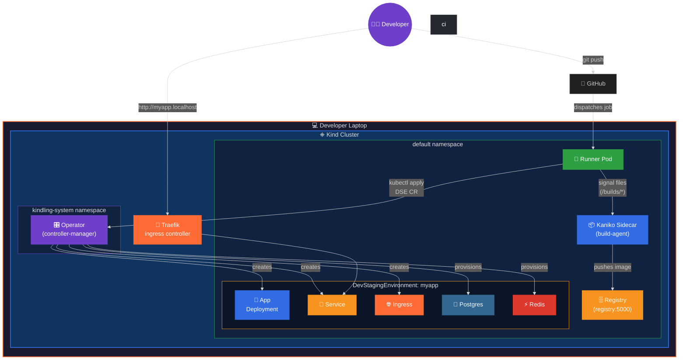
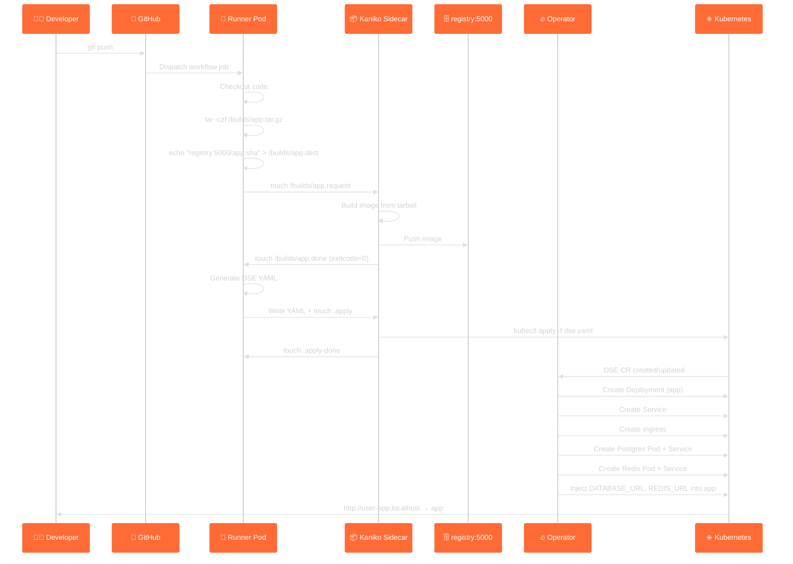

# Architecture

This document describes the internal architecture of kindling — a
Kubernetes operator that gives every developer an isolated staging
environment on their local machine using [Kind](https://kind.sigs.k8s.io).

---

## System overview



---

## Components

### 1. Kind cluster

A local Kubernetes cluster created by [Kind](https://kind.sigs.k8s.io).
The cluster configuration includes:

- **Single control-plane node** with the `ingress-ready` label
- **Port mappings** for HTTP (80) and HTTPS (443) on the host
- **Containerd mirror** pointing `registry:5000` to the in-cluster
  registry container, so Kubernetes can pull images built by Kaniko
  without leaving the cluster

### 2. Operator (controller-manager)

A [Kubebuilder](https://book.kubebuilder.io)-based Go controller that
runs in the `kindling-system` namespace. It watches two CRDs:

| CRD | Purpose |
|---|---|
| `DevStagingEnvironment` | Declares an app + its backing services |
| `CIRunnerPool` | Declares a self-hosted CI runner pool (GitHub Actions or GitLab CI) |

**Reconcile loop for DevStagingEnvironment:**

```
CR applied → reconcileDeployment
           → reconcileService
           → reconcileIngress (if enabled)
           → reconcileDependencies (for each dep: Secret + Deployment + Service)
           → updateStatus
```

All child resources have `OwnerReferences` pointing back to the CR, so
deleting the CR garbage-collects everything.

**Spec-hash annotations:** The operator computes a SHA-256 hash of each
sub-spec and stores it as the `apps.example.com/spec-hash` annotation.
On reconcile, if the hash hasn't changed, the update is skipped — this
prevents unnecessary writes and reconcile loops.

### 3. CI Runner Pod

Created by the `CIRunnerPool` controller. Each runner pod has:

| Container | Image | Purpose |
|---|---|---|
| **runner** | Platform-specific runner image | Registers with CI platform (GitHub or GitLab), polls for jobs |
| **build-agent** | `bitnami/kubectl` | Watches `/builds/` for build requests, launches Kaniko pods |

The two containers share an `emptyDir` volume mounted at `/builds/`.

### 4. Kaniko build-agent (sidecar)

The build-agent sidecar watches for signal files in `/builds/`.

:::warning Dockerfile requirement
Kaniko executes the Dockerfile from the build context exactly as-is. It does not generate or modify Dockerfiles. Each service must ship a Dockerfile that builds successfully on its own (`docker build .`). Kaniko is stricter than local Docker — for example, `COPY`-ing a file that doesn't exist (like a missing lockfile) will fail the build immediately.
:::

```
Signal file protocol:

  Runner writes:                    Build-agent reads & acts:
  ──────────────                    ─────────────────────────
  /builds/<name>.tar.gz             Build context (tarball)
  /builds/<name>.dest               Target image reference
  /builds/<name>.dockerfile         Dockerfile path (optional)
  /builds/<name>.request            Trigger → start build

  Build-agent writes back:
  ────────────────────────
  /builds/<name>.done               Build finished
  /builds/<name>.exitcode           Exit code (0 = success)
  /builds/<name>.log                Build log output
```

For `kubectl` operations, the sidecar watches for `.kubectl` signal files:

```
  Runner writes:                    Build-agent reads & acts:
  ──────────────                    ─────────────────────────
  /builds/<name>.sh                 Shell script to execute
  /builds/<name>.kubectl            Trigger → run script

  Build-agent writes back:
  ────────────────────────
  /builds/<name>.kubectl-done       Execution finished
  /builds/<name>.kubectl-exitcode   Exit code
  /builds/<name>.kubectl-log        Output log
```

For DSE YAML apply operations:

```
  Runner writes:                    Build-agent reads & acts:
  ──────────────                    ─────────────────────────
  /builds/<name>-dse.yaml           Generated DSE manifest
  /builds/<name>-dse.apply          Trigger → kubectl apply

  Build-agent writes back:
  ────────────────────────
  /builds/<name>-dse.apply-done     Apply finished
  /builds/<name>-dse.apply-exitcode Exit code
  /builds/<name>-dse.apply-log      Output log
```

### 5. In-cluster registry

A standard Docker registry (`registry:2`) running as a Deployment +
Service at `registry:5000`. The Kind node's containerd is configured to
mirror this registry, so `image: registry:5000/myapp:tag` works without
any `imagePullPolicy` hacks.

### 6. Traefik ingress controller

Traefik v3.6 runs as a DaemonSet with hostNetwork in the `traefik`
namespace, providing HTTP routing from `*.localhost` hostnames to
in-cluster Services. The IngressClass name is `traefik`.

---

## Data flow: git push → running app



---

## Namespace layout

| Namespace | Contents |
|---|---|
| `kindling-system` | Operator Deployment, ServiceAccount, RBAC |
| `default` | Runner pods, DSE resources (apps, deps, services, ingresses), registry |
| `traefik` | Traefik ingress controller pods |

---

## Dependency provisioning

When the operator encounters a `dependencies:` block in a DSE CR, for
**each** dependency it creates:

1. **Secret** (`<name>-<type>-credentials`) — credential key/values
   plus the computed `CONNECTION_URL`
2. **Deployment** (`<name>-<type>`) — single-replica pod running the
   service image with appropriate env vars and args
3. **Service** (`<name>-<type>`) — ClusterIP service exposing the
   default port

The operator then injects connection-string env vars (e.g.
`DATABASE_URL`, `REDIS_URL`) directly into the **app container's** env
block. Some dependencies inject additional env vars:

| Dependency | Extra env vars injected into app |
|---|---|
| MinIO | `S3_ACCESS_KEY`, `S3_SECRET_KEY` |
| Vault | `VAULT_TOKEN` |
| InfluxDB | `INFLUXDB_ORG`, `INFLUXDB_BUCKET` |
| Jaeger | `OTEL_EXPORTER_OTLP_ENDPOINT` |

See [Dependency Reference](dependencies.md) for the full reference.

---

## AI workflow generation pipeline

`kindling generate` uses a multi-stage pipeline to produce accurate
workflow files:

```
Repo scan → docker-compose analysis → Helm/Kustomize render → .env template scan → Credential detection → OAuth detection → Prompt assembly → AI call → YAML output
```

### Stage 1: Repo scan
Walks the directory tree collecting Dockerfiles, dependency manifests
(go.mod, package.json, requirements.txt, etc.), docker-compose.yml, and
source file entry points.

### Stage 2: docker-compose analysis
If `docker-compose.yml` or `docker-compose.yaml` is found, it becomes the
authoritative source for build contexts, inter-service dependencies, and
environment variable mappings.

### Stage 3: Helm & Kustomize rendering
If `Chart.yaml` or `kustomization.yaml` is found, runs `helm template`
or `kustomize build` to produce rendered manifests.

### Stage 4: .env template file scanning
Scans `.env.sample`, `.env.example`, `.env.development`, and
`.env.template` files for required configuration variables.

### Stage 5: External credential detection
Scans all collected content for env var patterns matching external
credentials (`*_API_KEY`, `*_SECRET`, `*_TOKEN`, `*_DSN`, etc.).

### Stage 6: OAuth / OIDC detection
Scans for 40+ patterns indicating OAuth usage (Auth0, Okta, Firebase
Auth, NextAuth, Passport.js, OIDC discovery endpoints, redirect URIs,
callback routes).

### Stage 7: Prompt assembly
Builds a system prompt with kindling conventions and a user prompt
containing all collected context. The system prompt covers 9 languages,
15 dependency types, build timeout guidance, Dockerfile pitfalls, and
a dev staging environment philosophy.

### Stage 8: AI call & output
Calls OpenAI or Anthropic, cleans the response (strips markdown fences),
and writes the YAML. For OpenAI reasoning models (o3, o3-mini), uses the
`developer` role and `max_completion_tokens` with a 5-minute timeout.

---

## Secrets management

`kindling secrets` stores external credentials as Kubernetes Secrets
with the label `app.kubernetes.io/managed-by=kindling`.

```
kindling secrets set STRIPE_KEY sk_live_...
       │
       ├──→ kubectl create secret generic kindling-secret-stripe-key
       │       --from-literal=value=sk_live_...
       │       -l app.kubernetes.io/managed-by=kindling
       │
       └──→ .kindling/secrets.yaml  (base64-encoded local backup)
```

**Naming convention:** `STRIPE_KEY` → K8s Secret `kindling-secret-stripe-key`

The local backup at `.kindling/secrets.yaml` survives cluster rebuilds.
After `kindling destroy` + `kindling init`, run `kindling secrets restore`
to re-create all secrets from the backup.

---

## Public HTTPS tunnels

`kindling expose` creates a secure tunnel for OAuth callbacks:

```
Internet → Tunnel Provider (TLS) → localhost:80 → Traefik → App Pod
```

Supported providers:
- **cloudflared** — Cloudflare Tunnel quick tunnels (free, no account)
- **ngrok** — requires free account + auth token

---

## Owner references and garbage collection

Every resource the operator creates has an `OwnerReference` pointing to
the parent `DevStagingEnvironment` CR. When you delete the CR:

```bash
kubectl delete devstagingenvironment myapp
```

Kubernetes' garbage collector automatically deletes all child resources.

---

## CI Provider Abstraction

kindling has decoupled all CI/CD-platform-specific code behind a
provider interface layer in `pkg/ci`. Two implementations are shipped:
**GitHub Actions** and **GitLab CI**. The interfaces are designed so
that additional providers (Bitbucket Pipelines, Gitea Actions, etc.)
can be added without touching the operator or CLI code.

### Provider registry

Providers register themselves at init-time via `ci.Register()`. All
consumers call `ci.Default()` to get the active provider — by default
that returns the GitHub Actions provider. Use `ci.Get("gitlab")` or
the `--ci-provider gitlab` CLI flag to select GitLab.

```go
provider := ci.Default()              // → GitHubProvider
provider.Name()                        // "github"
provider.DisplayName()                 // "GitHub Actions"
provider.Runner()                      // → RunnerAdapter
provider.Workflow()                    // → WorkflowGenerator
provider.CLILabels()                   // → CLILabels
```

### Interface: `Provider`

Top-level interface that wraps all provider-specific functionality.

| Method | Returns | Description |
|---|---|---|
| `Name()` | `string` | Short identifier (`"github"`, `"gitlab"`) |
| `DisplayName()` | `string` | Human-readable name (`"GitHub Actions"`) |
| `Runner()` | `RunnerAdapter` | Runner registration and lifecycle |
| `Workflow()` | `WorkflowGenerator` | AI workflow file generation |
| `CLILabels()` | `CLILabels` | Human-facing labels for CLI prompts |

### Interface: `RunnerAdapter`

Abstracts CI runner registration and lifecycle management. The operator
controller uses this interface to build runner Deployments, RBAC
resources, and startup scripts without knowing which CI platform is in use.

| Method | Signature | Description |
|---|---|---|
| `DefaultImage` | `() string` | Container image for self-hosted runners |
| `DefaultTokenKey` | `() string` | Key name within the CI token Secret |
| `APIBaseURL` | `(platformURL string) string` | Compute platform API URL from base URL |
| `RunnerEnvVars` | `(cfg RunnerEnvConfig) []ContainerEnvVar` | Env vars for the runner container |
| `StartupScript` | `() string` | Shell script to register, run, and de-register the runner |
| `RunnerLabels` | `(username, crName string) map[string]string` | Kubernetes labels for runner resources |
| `DeploymentName` | `(username string) string` | Runner Deployment name |
| `ServiceAccountName` | `(username string) string` | Runner ServiceAccount name |
| `ClusterRoleName` | `(username string) string` | Runner ClusterRole name |
| `ClusterRoleBindingName` | `(username string) string` | Runner ClusterRoleBinding name |

**Supporting types:**

```go
// RunnerEnvConfig — provider-agnostic runner configuration
type RunnerEnvConfig struct {
    Username, Repository, PlatformURL string
    TokenSecretName, TokenSecretKey   string
    Labels                            []string
    RunnerGroup, WorkDir, CRName      string
}

// ContainerEnvVar — either a plain value or a Secret reference
type ContainerEnvVar struct {
    Name      string
    Value     string      // plain text
    SecretRef *SecretRef  // mutually exclusive with Value
}

type SecretRef struct { Name, Key string }
```

### Interface: `WorkflowGenerator`

Abstracts CI workflow file generation for `kindling generate`.

| Method | Signature | Description |
|---|---|---|
| `DefaultOutputPath` | `() string` | Default workflow file path (e.g. `.github/workflows/dev-deploy.yml`) |
| `PromptContext` | `() PromptContext` | CI-specific values interpolated into the AI system prompt |
| `ExampleWorkflows` | `() (single, multi string)` | Reference workflow examples for the AI prompt |
| `StripTemplateExpressions` | `(content string) string` | Remove CI-specific template expressions (for fuzz/analysis) |

**`PromptContext` struct:**

| Field | Type | Example (GitHub) |
|---|---|---|
| `PlatformName` | `string` | `"GitHub Actions"` |
| `WorkflowNoun` | `string` | `"workflow"` |
| `BuildActionRef` | `string` | `"kindling-sh/kindling/.github/actions/kindling-build@main"` |
| `DeployActionRef` | `string` | `"kindling-sh/kindling/.github/actions/kindling-deploy@main"` |
| `CheckoutAction` | `string` | `"actions/checkout@v4"` |
| `ActorExpr` | `string` | `"${{ github.actor }}"` |
| `SHAExpr` | `string` | `"${{ github.sha }}"` |
| `WorkspaceExpr` | `string` | `"${{ github.workspace }}"` |
| `RunnerSpec` | `string` | `[self-hosted, "${{ github.actor }}"]` |
| `EnvTagExpr` | `string` | `"${{ github.actor }}-${{ github.sha }}"` |
| `TriggerBlock` | `func(branch) string` | YAML trigger block for a given branch |
| `WorkflowFileDescription` | `string` | `"GitHub Actions workflow"` |

### Struct: `CLILabels`

Human-facing labels used throughout CLI commands for prompts, output,
and resource naming.

| Field | Type | Example (GitHub) |
|---|---|---|
| `Username` | `string` | `"GitHub username"` |
| `Repository` | `string` | `"GitHub repository (owner/repo)"` |
| `Token` | `string` | `"GitHub PAT (repo scope)"` |
| `SecretName` | `string` | `"github-runner-token"` |
| `CRDKind` | `string` | `"CIRunnerPool"` |
| `CRDPlural` | `string` | `"cirunnerpools"` |
| `CRDListHeader` | `string` | `"GitHub Actions Runner Pools"` |
| `RunnerComponent` | `string` | `"github-actions-runner"` |
| `ActionsURLFmt` | `string` | `"https://github.com/%s/actions"` |
| `CRDAPIVersion` | `string` | `"apps.example.com/v1alpha1"` |

### Adding a new provider

To add support for a new CI platform (e.g. GitLab CI):

1. Create `pkg/ci/gitlab.go` implementing `Provider`, `RunnerAdapter`,
   and `WorkflowGenerator`
2. Register it in an `init()` function: `Register(&GitLabProvider{})`
3. No changes needed in the operator controller or CLI commands — they
   call `ci.Default()` and use the interfaces

---

## Project layout

```
kindling/
├── api/v1alpha1/                   # CRD type definitions
│   ├── devstagingenvironment_types.go
│   ├── cirunnerpool_types.go
│   └── groupversion_info.go
├── internal/controller/            # Reconcile logic
│   ├── devstagingenvironment_controller.go
│   └── cirunnerpool_controller.go
├── cmd/main.go                     # Operator entrypoint
├── pkg/ci/                         # CI provider abstraction
│   ├── types.go                    # Provider, RunnerAdapter, WorkflowGenerator interfaces
│   ├── registry.go                 # Provider registry (Register, Default, Get)
│   ├── github.go                   # GitHub Actions implementation
│   └── gitlab.go                   # GitLab CI implementation
├── cli/                            # CLI tool (separate Go module)
│   ├── cmd/
│   │   ├── root.go
│   │   ├── init.go
│   │   ├── runners.go
│   │   ├── generate.go
│   │   ├── secrets.go
│   │   ├── expose.go
│   │   ├── env.go
│   │   ├── reset.go
│   │   ├── deploy.go
│   │   ├── status.go
│   │   ├── logs.go
│   │   ├── destroy.go
│   │   ├── version.go
│   │   └── helpers.go
│   ├── main.go
│   └── go.mod
├── config/                         # Kustomize manifests
├── .github/actions/                # Reusable composite actions
│   ├── kindling-build/action.yml
│   └── kindling-deploy/action.yml
├── examples/                       # Example apps
├── docs/                           # Documentation
├── kind-config.yaml                # Kind cluster config
├── setup-ingress.sh                # Ingress + registry installer
├── Makefile                        # Build targets
└── Dockerfile                      # Operator container image
```
