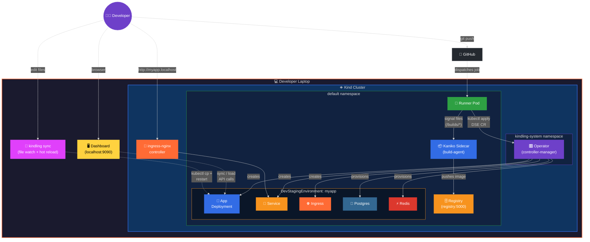
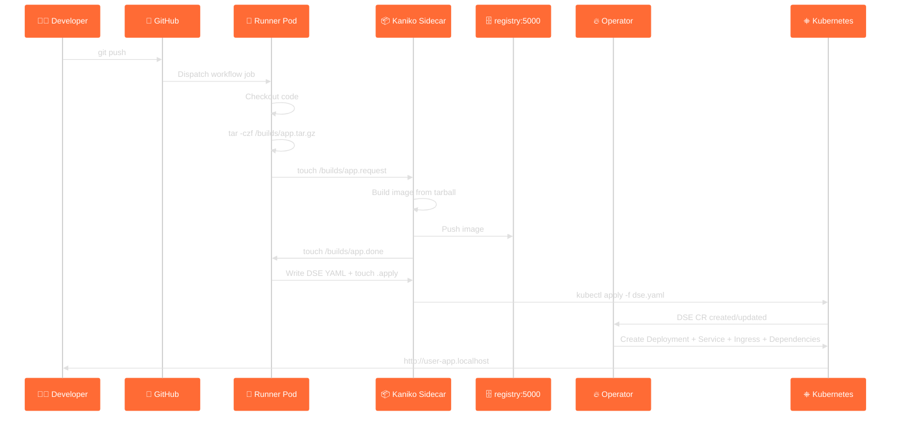
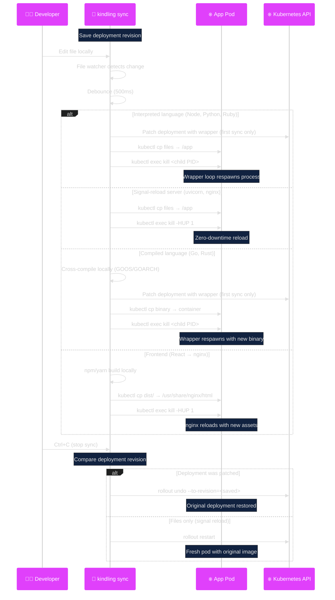

# Architecture

kindling implements a **dev-in-CI** workflow — two nested development
loops running on a local [Kind](https://kind.sigs.k8s.io) cluster. The
**outer loop** provides full CI/CD (push → build → deploy), and the
**inner loop** provides live sync with sub-second feedback.

---

## System overview



---

## The Two Loops

### Outer loop: CI on your laptop

```
git push → GitHub Actions → self-hosted runner → Kaniko build → registry:5000 → operator deploys DSE
```

The outer loop uses GitHub Actions as the trigger mechanism, but the
actual compute runs locally. The self-hosted runner picks up jobs,
builds containers via Kaniko (no Docker daemon), pushes to the
in-cluster registry, and applies DevStagingEnvironment CRs that the
operator reconciles into running Deployments.

### Inner loop: Live sync + hot reload

```
edit file → kindling sync → kubectl cp → auto-detected restart → see changes → (stop → rollback)
```

The inner loop bypasses CI entirely. `kindling sync` watches local
files, copies them directly into the running container, and restarts
the process using a strategy matched to the runtime. When sync stops,
the deployment rolls back automatically.

Both loops operate on the same Kind cluster and the same deployments.
The inner loop is nested inside the outer loop — you iterate fast with
sync, then commit and push when ready.

---

## Components

### 1. Kind cluster

A local Kubernetes cluster created by [Kind](https://kind.sigs.k8s.io).
The cluster configuration ([kind-config.yaml](../kind-config.yaml))
includes:

- **Single control-plane node** with the `ingress-ready` label
- **Port mappings** for HTTP (80) and HTTPS (443) on the host
- **Containerd mirror** pointing `registry:5000` to the in-cluster
  registry, so Kubernetes can pull images built by Kaniko

### 2. Operator (controller-manager)

A [Kubebuilder](https://book.kubebuilder.io)-based Go controller in
the `kindling-system` namespace. It watches two CRDs:

| CRD | Purpose |
|---|---|
| `DevStagingEnvironment` | Declares an app + its backing services |
| `GithubActionRunnerPool` | Declares a self-hosted GitHub Actions runner |

**Reconcile loop for DevStagingEnvironment:**

```
CR applied → reconcileDeployment
           → reconcileService
           → reconcileIngress (if enabled)
           → reconcileDependencies (for each dep: Secret + Deployment + Service)
           → updateStatus
```

All child resources have `OwnerReferences` pointing back to the CR, so
deleting the CR garbage-collects everything.

**Spec-hash annotations:** The operator computes a SHA-256 hash of each
sub-spec and stores it as the `apps.example.com/spec-hash` annotation.
On reconcile, if the hash hasn't changed, the update is skipped.

### 3. CI Runner Pod

Created by the `GithubActionRunnerPool` controller. Each runner pod has:

| Container | Image | Purpose |
|---|---|---|
| **runner** | `ghcr.io/actions/actions-runner:latest` | Registers with GitHub, polls for jobs |
| **build-agent** | `bitnami/kubectl` | Watches `/builds/` for build requests, launches Kaniko pods |

The two containers share an `emptyDir` volume mounted at `/builds/`.

### 4. Kaniko build-agent (sidecar)

The build-agent sidecar watches for signal files in `/builds/`.

```
Signal file protocol:

  Runner writes:                    Build-agent reads & acts:
  ──────────────                    ─────────────────────────
  /builds/<name>.tar.gz             Build context (tarball)
  /builds/<name>.dest               Target image reference
  /builds/<name>.dockerfile         Dockerfile path (optional)
  /builds/<name>.request            Trigger → start build

  Build-agent writes back:
  ────────────────────────
  /builds/<name>.done               Build finished
  /builds/<name>.exitcode           Exit code (0 = success)
  /builds/<name>.log                Build log output
```

### 5. In-cluster registry

A standard Docker registry (`registry:2`) running at `registry:5000`.
The Kind node's containerd is configured to mirror this registry.

### 6. Ingress-nginx controller

Routes `*.localhost` hostnames to in-cluster Services. The Kind config
maps host ports 80/443 → the ingress controller pod.

### 7. Live sync engine (`kindling sync`)

The sync engine is built into the CLI. It operates outside the cluster,
using `kubectl cp` and `kubectl exec` to interact with running pods.

**Architecture:**

```
┌─────────────────────────────────────────────────────┐
│ kindling sync                                       │
│                                                     │
│  ┌──────────────┐   ┌──────────────┐   ┌─────────┐ │
│  │ File Watcher  │──►│ Debouncer    │──►│ Sync    │ │
│  │ (fsnotify)    │   │ (500ms)      │   │ Engine  │ │
│  └──────────────┘   └──────────────┘   └────┬────┘ │
│                                              │      │
│  ┌──────────────────────────────────────────┐│      │
│  │ Runtime Detector                         ││      │
│  │ • Reads /proc/1/cmdline from container   ││      │
│  │ • Matches 30+ process signatures         ││      │
│  │ • Determines restart mode:               ││      │
│  │   - modeSignal (SIGHUP/SIGUSR2)         ││      │
│  │   - modeKill (wrapper + kill)            ││      │
│  │   - modeRebuild (cross-compile + sync)   ││      │
│  │   - modeAutoReload (sync only)           ││      │
│  └──────────────────────────────────────────┘│      │
│                                              │      │
│  ┌──────────────────────────────────────────┐│      │
│  │ Restart Strategies                       ││      │
│  │                                          ▼│      │
│  │ signalReload: kubectl exec kill -HUP 1   │      │
│  │ wrapperKill:  patch deployment with       │      │
│  │               restart-loop wrapper,       │      │
│  │               kubectl exec kill <child>   │      │
│  │ rebuild:      cross-compile locally,      │      │
│  │               kubectl cp binary,          │      │
│  │               patch + restart via wrapper │      │
│  │ frontendBuild: npm/yarn build locally,    │      │
│  │               kubectl cp dist/ to nginx   │      │
│  └──────────────────────────────────────────┘│      │
│                                              │      │
│  ┌──────────────────────────────────────────┐│      │
│  │ Deployment Rollback (on stop)            ││      │
│  │                                          ▼│      │
│  │ • Saves deployment revision before sync   │      │
│  │ • Compares revision after sync starts     │      │
│  │ • If patched: rollout undo --to-revision  │      │
│  │ • If not: rollout restart                 │      │
│  └──────────────────────────────────────────┘│      │
└─────────────────────────────────────────────────────┘
```

**Runtime detection table (subset):**

| Process signature | Mode | Interpreted? |
|---|---|---|
| `node`, `deno`, `bun` | modeKill | yes |
| `python`, `python3` | modeKill | yes |
| `ruby`, `perl`, `lua` | modeKill | yes |
| `uvicorn`, `gunicorn` | modeSignal | yes |
| `puma`, `unicorn` | modeSignal | yes |
| `nginx`, `httpd` | modeSignal | no |
| `php-fpm`, `php` | modeAutoReload | yes |
| `go` binary (detected) | modeRebuild | no |
| `cargo`, `rustc` | modeRebuild | no |
| `java`, `dotnet` | modeRebuild | no |

**Frontend detection:** When a project has `package.json` with a build
script and the container runs nginx, the sync engine runs the local
build (npm/yarn/pnpm), then syncs only the built output (dist/build)
into the nginx html root — never the source tree.

**Cross-compilation:** For compiled languages, the sync engine queries
`kubectl get nodes -o jsonpath='{.items[0].status.nodeInfo.architecture}'`
and generates the correct cross-compilation command:
- **Go** — `CGO_ENABLED=0 GOOS=linux GOARCH=arm64 go build -o <tmp> .`
- **Rust** — `cargo build --release --target aarch64-unknown-linux-gnu`
- **Java** — `mvn package -DskipTests` or `gradle build -x test`
- **.NET** — `dotnet publish -r linux-arm64 -c Release --self-contained`

### 8. Web dashboard

The dashboard is a React/TypeScript SPA embedded in the CLI binary via
Go's `embed` package. It runs as an HTTP server on `localhost:9090`.

**Architecture:**

```
┌──────────────────────────────────────────────────────┐
│ kindling dashboard                                   │
│                                                      │
│  ┌─────────────────────────────────────────────────┐ │
│  │ HTTP Server (Go net/http)                       │ │
│  │                                                 │ │
│  │ Read-only API (dashboard_api.go):               │ │
│  │   /api/cluster, /api/pods, /api/dses,           │ │
│  │   /api/services, /api/ingresses, /api/events,   │ │
│  │   /api/logs/, /api/runtime/{ns}/{dep}, ...      │ │
│  │                                                 │ │
│  │ Action API (dashboard_actions.go):              │ │
│  │   POST /api/sync      — start sync session      │ │
│  │   DELETE /api/sync    — stop sync (auto rollback)│ │
│  │   GET /api/sync/status — poll sync state        │ │
│  │   POST /api/load      — docker build + load     │ │
│  │   GET /api/load-context — discover service dirs │ │
│  │   GET /api/runtime/{ns}/{dep} — detect runtime  │ │
│  │   POST /api/deploy    — apply DSE YAML          │ │
│  │   POST /api/env/set   — set env vars            │ │
│  │   ...                                           │ │
│  │                                                 │ │
│  │ Static files (embedded React SPA):              │ │
│  │   / → dashboard-ui/dist/index.html              │ │
│  └─────────────────────────────────────────────────┘ │
│                                                      │
│  ┌─────────────────────────────────────────────────┐ │
│  │ React Frontend (dashboard-ui/)                  │ │
│  │                                                 │ │
│  │ Components:                                     │ │
│  │   SyncModal — runtime detection, dir picker,    │ │
│  │              sync status, stop button           │ │
│  │   LoadModal — docker build + kind load flow     │ │
│  │   Runtime badges — per-service runtime labels   │ │
│  │   Log viewer — real-time container log tailing  │ │
│  │   Resource panels — pods, services, ingresses   │ │
│  └─────────────────────────────────────────────────┘ │
└──────────────────────────────────────────────────────┘
```

The dashboard calls the same sync logic as the CLI — the action API
handlers in `dashboard_actions.go` invoke `syncAndRestart` from
`sync.go`, including all runtime detection, restart strategy selection,
and automatic rollback on stop.

---

## Data flow: Outer loop (git push → running app)



## Data flow: Inner loop (sync → instant feedback)



---

## Namespace layout

| Namespace | Contents |
|---|---|
| `kindling-system` | Operator Deployment, ServiceAccount, RBAC |
| `default` | Runner pods, DSE resources (apps, deps, services, ingresses), registry |
| `ingress-nginx` | ingress-nginx controller pods |

---

## Dependency provisioning

When the operator encounters a `dependencies:` block in a DSE CR, for
**each** dependency it creates:

1. **Secret** (`<name>-<type>-credentials`) — credential key/values
   plus the computed `CONNECTION_URL`
2. **Deployment** (`<name>-<type>`) — single-replica pod running the
   service image
3. **Service** (`<name>-<type>`) — ClusterIP service exposing the
   default port

The operator then injects connection-string env vars (e.g.
`DATABASE_URL`, `REDIS_URL`) directly into the app container.

See [dependencies.md](dependencies.md) for the full reference.

---

## AI workflow generation pipeline

`kindling generate` uses a multi-stage pipeline:

```
Repo scan → docker-compose analysis → Helm/Kustomize render → .env scan → Credential detection → OAuth detection → Prompt assembly → AI call → YAML output
```

1. **Repo scan** — Walks directory tree collecting Dockerfiles, dependency manifests, source files
2. **docker-compose analysis** — Uses docker-compose as source of truth for build contexts, dependencies, env vars
3. **Helm & Kustomize** — Renders charts/overlays for accurate context
4. **`.env` scanning** — Distinguishes external credentials from app config
5. **Credential detection** — Flags `*_API_KEY`, `*_SECRET`, `*_TOKEN` patterns
6. **OAuth detection** — Flags Auth0, Okta, Firebase Auth, etc.
7. **Prompt assembly** — Builds system + user prompt with all context
8. **AI call** — OpenAI or Anthropic (supports reasoning models: o3, o3-mini)

---

## Secrets management

```
kindling secrets set STRIPE_KEY sk_live_...
       │
       ├──→ kubectl create secret generic kindling-secret-stripe-key
       │       --from-literal=value=sk_live_...
       │       -l app.kubernetes.io/managed-by=kindling
       │
       └──→ .kindling/secrets.yaml  (base64-encoded local backup)
```

The local backup survives cluster rebuilds. After `kindling init`, run
`kindling secrets restore` to re-create all secrets.

---

## Public HTTPS tunnels

```
Internet → Tunnel Provider (TLS) → localhost:80 → ingress-nginx → App Pod
```

Supported: cloudflared (free, no account) and ngrok (free account required).

---

## Owner references and garbage collection

Every resource the operator creates has an `OwnerReference` pointing to
the parent `DevStagingEnvironment` CR. Deleting the CR garbage-collects
all child resources automatically.

---

## CI Provider Abstraction *(upcoming)*

kindling is decoupling all CI/CD-platform-specific code behind a
provider interface layer in `pkg/ci`. Today the only implementation is
GitHub Actions, but the interfaces are designed so that a GitLab CI,
Bitbucket Pipelines, or other provider can be added without touching
the operator or CLI code.

### Provider registry

Providers register themselves at init-time via `ci.Register()`. All
consumers call `ci.Default()` to get the active provider — today that
returns the GitHub Actions provider.

```go
provider := ci.Default()              // → GitHubProvider
provider.Name()                        // "github"
provider.DisplayName()                 // "GitHub Actions"
provider.Runner()                      // → RunnerAdapter
provider.Workflow()                    // → WorkflowGenerator
provider.CLILabels()                   // → CLILabels
```

### Interface: `Provider`

Top-level interface that wraps all provider-specific functionality.

| Method | Returns | Description |
|---|---|---|
| `Name()` | `string` | Short identifier (`"github"`, `"gitlab"`) |
| `DisplayName()` | `string` | Human-readable name (`"GitHub Actions"`) |
| `Runner()` | `RunnerAdapter` | Runner registration and lifecycle |
| `Workflow()` | `WorkflowGenerator` | AI workflow file generation |
| `CLILabels()` | `CLILabels` | Human-facing labels for CLI prompts |

### Interface: `RunnerAdapter`

Abstracts CI runner registration and lifecycle management. The operator
controller uses this interface to build runner Deployments, RBAC
resources, and startup scripts without knowing which CI platform is in use.

| Method | Signature | Description |
|---|---|---|
| `DefaultImage` | `() string` | Container image for self-hosted runners |
| `DefaultTokenKey` | `() string` | Key name within the CI token Secret |
| `APIBaseURL` | `(platformURL string) string` | Compute platform API URL from base URL |
| `RunnerEnvVars` | `(cfg RunnerEnvConfig) []ContainerEnvVar` | Env vars for the runner container |
| `StartupScript` | `() string` | Shell script to register, run, and de-register the runner |
| `RunnerLabels` | `(username, crName string) map[string]string` | Kubernetes labels for runner resources |
| `DeploymentName` | `(username string) string` | Runner Deployment name |
| `ServiceAccountName` | `(username string) string` | Runner ServiceAccount name |
| `ClusterRoleName` | `(username string) string` | Runner ClusterRole name |
| `ClusterRoleBindingName` | `(username string) string` | Runner ClusterRoleBinding name |

**Supporting types:**

```go
// RunnerEnvConfig — provider-agnostic runner configuration
type RunnerEnvConfig struct {
    Username, Repository, PlatformURL string
    TokenSecretName, TokenSecretKey   string
    Labels                            []string
    RunnerGroup, WorkDir, CRName      string
}

// ContainerEnvVar — either a plain value or a Secret reference
type ContainerEnvVar struct {
    Name      string
    Value     string      // plain text
    SecretRef *SecretRef  // mutually exclusive with Value
}

type SecretRef struct { Name, Key string }
```

### Interface: `WorkflowGenerator`

Abstracts CI workflow file generation for `kindling generate`.

| Method | Signature | Description |
|---|---|---|
| `DefaultOutputPath` | `() string` | Default workflow file path (e.g. `.github/workflows/dev-deploy.yml`) |
| `PromptContext` | `() PromptContext` | CI-specific values interpolated into the AI system prompt |
| `ExampleWorkflows` | `() (single, multi string)` | Reference workflow examples for the AI prompt |
| `StripTemplateExpressions` | `(content string) string` | Remove CI-specific template expressions (for fuzz/analysis) |

**`PromptContext` struct:**

| Field | Type | Example (GitHub) |
|---|---|---|
| `PlatformName` | `string` | `"GitHub Actions"` |
| `WorkflowNoun` | `string` | `"workflow"` |
| `BuildActionRef` | `string` | `"kindling-sh/kindling/.github/actions/kindling-build@main"` |
| `DeployActionRef` | `string` | `"kindling-sh/kindling/.github/actions/kindling-deploy@main"` |
| `CheckoutAction` | `string` | `"actions/checkout@v4"` |
| `ActorExpr` | `string` | `"${{ github.actor }}"` |
| `SHAExpr` | `string` | `"${{ github.sha }}"` |
| `WorkspaceExpr` | `string` | `"${{ github.workspace }}"` |
| `RunnerSpec` | `string` | `[self-hosted, "${{ github.actor }}"]` |
| `EnvTagExpr` | `string` | `"${{ github.actor }}-${{ github.sha }}"` |
| `TriggerBlock` | `func(branch) string` | YAML trigger block for a given branch |
| `WorkflowFileDescription` | `string` | `"GitHub Actions workflow"` |

### Struct: `CLILabels`

Human-facing labels used throughout CLI commands for prompts, output,
and resource naming.

| Field | Type | Example (GitHub) |
|---|---|---|
| `Username` | `string` | `"GitHub username"` |
| `Repository` | `string` | `"GitHub repository (owner/repo)"` |
| `Token` | `string` | `"GitHub PAT (repo scope)"` |
| `SecretName` | `string` | `"github-runner-token"` |
| `CRDKind` | `string` | `"GithubActionRunnerPool"` |
| `CRDPlural` | `string` | `"githubactionrunnerpools"` |
| `CRDListHeader` | `string` | `"GitHub Actions Runner Pools"` |
| `RunnerComponent` | `string` | `"github-actions-runner"` |
| `ActionsURLFmt` | `string` | `"https://github.com/%s/actions"` |
| `CRDAPIVersion` | `string` | `"apps.example.com/v1alpha1"` |

### Adding a new provider

To add support for a new CI platform (e.g. GitLab CI):

1. Create `pkg/ci/gitlab.go` implementing `Provider`, `RunnerAdapter`,
   and `WorkflowGenerator`
2. Register it in an `init()` function: `Register(&GitLabProvider{})`
3. No changes needed in the operator controller or CLI commands — they
   call `ci.Default()` and use the interfaces

---

## Project layout

```
kindling/
├── api/v1alpha1/                   # CRD type definitions
├── internal/controller/            # Operator reconcile logic
├── cmd/main.go                     # Operator entrypoint
├── pkg/ci/                         # CI provider abstraction (upcoming)
│   ├── types.go                    # Provider, RunnerAdapter, WorkflowGenerator interfaces
│   ├── registry.go                 # Provider registry (Register, Default, Get)
│   └── github.go                   # GitHub Actions implementation
├── cli/                            # CLI tool (separate Go module)
│   ├── cmd/
│   │   ├── root.go
│   │   ├── sync.go                 # Live sync + hot reload engine
│   │   ├── dashboard.go            # Web dashboard HTTP server
│   │   ├── dashboard_api.go        # Read-only API handlers
│   │   ├── dashboard_actions.go    # Mutation API (sync, load, deploy)
│   │   ├── dashboard-ui/          # React/TypeScript SPA
│   │   ├── generate.go             # AI workflow generation
│   │   ├── secrets.go
│   │   ├── expose.go
│   │   └── ...
│   └── main.go
├── config/                         # Kustomize manifests
├── .github/actions/                # Reusable composite actions
├── examples/                       # Example apps
├── docs/                           # Documentation
├── kind-config.yaml
├── setup-ingress.sh
├── Makefile
└── Dockerfile
```
