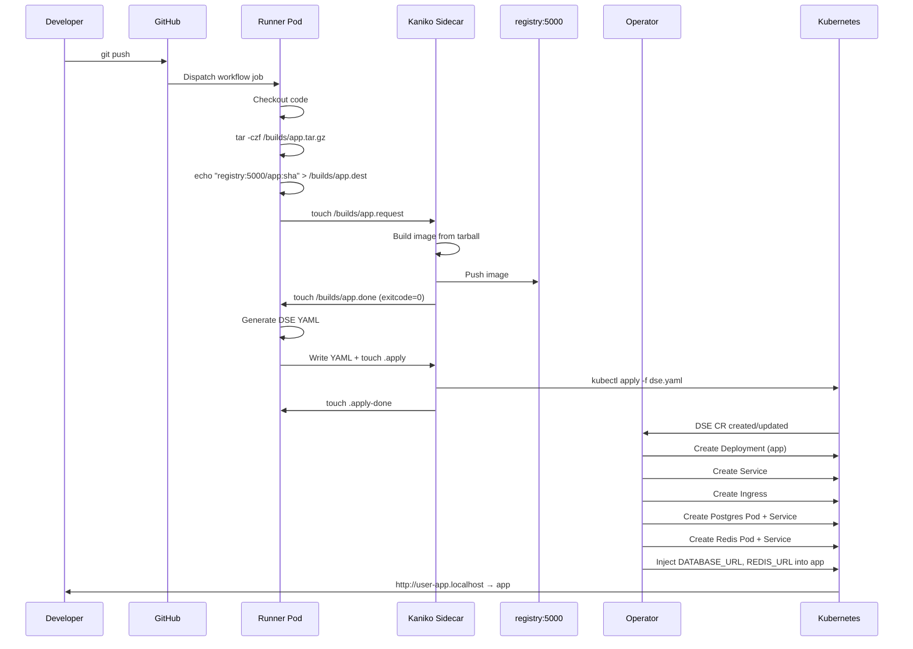

# Architecture

This document describes the internal architecture of kindling — a
Kubernetes operator that gives every developer an isolated staging
environment on their local machine using [Kind](https://kind.sigs.k8s.io).

---

## System overview

```mermaid
flowchart TB
    dev(("👩‍💻 Developer"))

    subgraph laptop["💻 Developer Laptop"]
        subgraph kind["⎈ Kind Cluster"]

            subgraph system["kindling-system namespace"]
                operator["🎛️ Operator\n(controller-manager)"]
            end

            subgraph default["default namespace"]
                runner["🏃 Runner Pod"]
                kaniko["📦 Kaniko Sidecar\n(build-agent)"]
                registry["🗄️ Registry\n(registry:5000)"]

                subgraph env1["DevStagingEnvironment: myapp"]
                    app["🔷 App\nDeployment"]
                    svc["🔶 Service"]
                    ing["🌐 Ingress"]
                    pg["🐘 Postgres"]
                    rd["⚡ Redis"]
                end
            end

            ingress_ctrl["🔶 ingress-nginx\ncontroller"]
        end
    end

    dev -- "git push" --> gh["🐙 GitHub"]
    gh -- "dispatches job" --> runner
    runner -- "signal files\n(/builds/*)" --> kaniko
    kaniko -- "pushes image" --> registry
    runner -- "kubectl apply\nDSE CR" --> operator
    operator -- "creates" --> app
    operator -- "creates" --> svc
    operator -- "creates" --> ing
    operator -- "provisions" --> pg
    operator -- "provisions" --> rd
    dev -- "http://myapp.localhost" --> ingress_ctrl
    ingress_ctrl --> svc

    style kind fill:#0f3460,stroke:#326CE5,color:#e0e0e0,stroke-width:2px
    style system fill:#1a1a2e,stroke:#6e40c9,color:#e0e0e0
    style default fill:#1a1a2e,stroke:#2ea043,color:#e0e0e0
    style env1 fill:#112240,stroke:#f0883e,color:#e0e0e0
    style operator fill:#6e40c9,stroke:#6e40c9,color:#fff
    style runner fill:#2ea043,stroke:#2ea043,color:#fff
    style kaniko fill:#326CE5,stroke:#326CE5,color:#fff
    style registry fill:#f0883e,stroke:#f0883e,color:#fff
    style ingress_ctrl fill:#FF6B35,stroke:#FF6B35,color:#fff
    style dev fill:#6e40c9,stroke:#6e40c9,color:#fff
    style gh fill:#333,stroke:#fff,color:#fff
```

---

## Components

### 1. Kind cluster

A local Kubernetes cluster created by [Kind](https://kind.sigs.k8s.io).
The cluster configuration ([kind-config.yaml](../kind-config.yaml))
includes:

- **Single control-plane node** with the `ingress-ready` label
- **Port mappings** for HTTP (80) and HTTPS (443) on the host
- **Containerd mirror** pointing `registry:5000` to the in-cluster
  registry container, so Kubernetes can pull images built by Kaniko
  without leaving the cluster

### 2. Operator (controller-manager)

A [Kubebuilder](https://book.kubebuilder.io)-based Go controller that
runs in the `kindling-system` namespace. It watches two CRDs:

| CRD | Purpose |
|---|---|
| `DevStagingEnvironment` | Declares an app + its backing services |
| `GithubActionRunnerPool` | Declares a self-hosted GitHub Actions runner |

**Reconcile loop for DevStagingEnvironment:**

```
CR applied → reconcileDeployment
           → reconcileService
           → reconcileIngress (if enabled)
           → reconcileDependencies (for each dep: Secret + Deployment + Service)
           → updateStatus
```

All child resources have `OwnerReferences` pointing back to the CR, so
deleting the CR garbage-collects everything.

**Spec-hash annotations:** The operator computes a SHA-256 hash of each
sub-spec and stores it as the `apps.example.com/spec-hash` annotation.
On reconcile, if the hash hasn't changed, the update is skipped — this
prevents unnecessary writes and reconcile loops.

### 3. GitHub Actions Runner Pod

Created by the `GithubActionRunnerPool` controller. Each runner pod has:

| Container | Image | Purpose |
|---|---|---|
| **runner** | `ghcr.io/actions/actions-runner:latest` | Registers with GitHub, polls for jobs |
| **build-agent** | `gcr.io/kaniko-project/executor` | Watches `/builds/` for build requests |

The two containers share an `emptyDir` volume mounted at `/builds/`.

### 4. Kaniko build-agent (sidecar)

The build-agent sidecar watches for signal files in `/builds/`.

> **⚠️ Dockerfile requirement:** Kaniko executes the Dockerfile from the
> build context exactly as-is. It does not generate or modify
> Dockerfiles. Each service must ship a Dockerfile that builds
> successfully on its own (`docker build .`). Kaniko is stricter than
> local Docker — for example, `COPY`-ing a file that doesn't exist
> (like a missing lockfile) will fail the build immediately.

```
Signal file protocol:

  Runner writes:                    Build-agent reads & acts:
  ──────────────                    ─────────────────────────
  /builds/<name>.tar.gz             Build context (tarball)
  /builds/<name>.dest               Target image reference
  /builds/<name>.request            Trigger → start build

  Build-agent writes back:
  ────────────────────────
  /builds/<name>.done               Build finished
  /builds/<name>.exitcode           Exit code (0 = success)
  /builds/<name>.log                Build log output
```

For `kubectl` operations, the sidecar watches for `.kubectl` signal files:

```
  Runner writes:                    Build-agent reads & acts:
  ──────────────                    ─────────────────────────
  /builds/<name>.sh                 Shell script to execute
  /builds/<name>.kubectl            Trigger → run script

  Build-agent writes back:
  ────────────────────────
  /builds/<name>.kubectl-done       Execution finished
  /builds/<name>.kubectl-exitcode   Exit code
  /builds/<name>.kubectl-log        Output log
```

For DSE YAML apply operations:

```
  Runner writes:                    Build-agent reads & acts:
  ──────────────                    ─────────────────────────
  /builds/<name>-dse.yaml           Generated DSE manifest
  /builds/<name>-dse.apply          Trigger → kubectl apply

  Build-agent writes back:
  ────────────────────────
  /builds/<name>-dse.apply-done     Apply finished
  /builds/<name>-dse.apply-exitcode Exit code
  /builds/<name>-dse.apply-log      Output log
```

### 5. In-cluster registry

A standard Docker registry (`registry:2`) running as a Deployment +
Service at `registry:5000`. The Kind node's containerd is configured to
mirror this registry, so `image: registry:5000/myapp:tag` works without
any `imagePullPolicy` hacks.

### 6. Ingress-nginx controller

Provides HTTP routing from `*.localhost` hostnames to in-cluster
Services. Installed by `setup-ingress.sh` with:

```bash
kubectl apply -f https://raw.githubusercontent.com/kubernetes/ingress-nginx/main/deploy/static/provider/kind/deploy.yaml
```

The Kind config maps host ports 80/443 → the ingress controller pod.

---

## Data flow: git push → running app



---

## Namespace layout

| Namespace | Contents |
|---|---|
| `kindling-system` | Operator Deployment, ServiceAccount, RBAC |
| `default` | Runner pods, DSE resources (apps, deps, services, ingresses), registry |
| `ingress-nginx` | ingress-nginx controller pods |

---

## Dependency provisioning

When the operator encounters a `dependencies:` block in a DSE CR, for
**each** dependency it creates:

1. **Secret** (`<name>-<type>-credentials`) — credential key/values
   plus the computed `CONNECTION_URL`
2. **Deployment** (`<name>-<type>`) — single-replica pod running the
   service image with appropriate env vars and args
3. **Service** (`<name>-<type>`) — ClusterIP service exposing the
   default port

The operator then injects connection-string env vars (e.g.
`DATABASE_URL`, `REDIS_URL`) directly into the **app container's** env
block. Some dependencies inject additional env vars:

| Dependency | Extra env vars injected into app |
|---|---|
| MinIO | `S3_ACCESS_KEY`, `S3_SECRET_KEY` |
| Vault | `VAULT_TOKEN` |
| InfluxDB | `INFLUXDB_ORG`, `INFLUXDB_BUCKET` |
| Jaeger | `OTEL_EXPORTER_OTLP_ENDPOINT` |

See [dependencies.md](dependencies.md) for the full reference.

---

## AI workflow generation pipeline

`kindling generate` uses a multi-stage pipeline to produce accurate
workflow files:

```
Repo scan → Helm/Kustomize render → Credential detection → OAuth detection → Prompt assembly → AI call → YAML output
```

### Stage 1: Repo scan
Walks the directory tree collecting Dockerfiles, dependency manifests
(go.mod, package.json, requirements.txt, etc.), docker-compose.yml, and
source file entry points. Prioritizes files by relevance (main.go,
app.py, index.ts, etc.).

### Stage 2: Helm & Kustomize rendering
If `Chart.yaml` or `kustomization.yaml` is found, runs `helm template`
or `kustomize build` to produce rendered manifests. These are passed to
the AI as authoritative context for ports, env vars, and service names.
Gracefully falls back if the tools aren’t installed.

### Stage 3: External credential detection
Scans all collected content for env var patterns matching external
credentials (`*_API_KEY`, `*_SECRET`, `*_TOKEN`, `*_DSN`, etc.). Also
checks `.env` files. Detected credentials are included in the AI prompt
so the generated workflow wires them as `secretKeyRef`.

### Stage 4: OAuth / OIDC detection
Scans for 40+ patterns indicating OAuth usage (Auth0, Okta, Firebase
Auth, NextAuth, Passport.js, OIDC discovery endpoints, redirect URIs,
callback routes). If detected, the CLI suggests `kindling expose` and
the AI adds tunnel-related comments to the workflow.

### Stage 5: Prompt assembly
Builds a system prompt with kindling conventions and a user prompt
containing all collected context. The system prompt covers 9 languages,
15 dependency types, build timeout guidance, and Dockerfile pitfalls.

### Stage 6: AI call & output
Calls OpenAI or Anthropic, cleans the response (strips markdown fences),
and writes the YAML to `.github/workflows/dev-deploy.yml`.

---

## Secrets management

`kindling secrets` stores external credentials as Kubernetes Secrets
with the label `app.kubernetes.io/managed-by=kindling`.

```
kindling secrets set STRIPE_KEY sk_live_...
       │
       ├──→ kubectl create secret generic kindling-secret-stripe-key
       │       --from-literal=value=sk_live_...
       │       -l app.kubernetes.io/managed-by=kindling
       │
       └──→ .kindling/secrets.yaml  (base64-encoded local backup)
```

**Naming convention:** `STRIPE_KEY` → K8s Secret `kindling-secret-stripe-key`

The local backup at `.kindling/secrets.yaml` survives cluster rebuilds.
After `kindling destroy` + `kindling init`, run `kindling secrets restore`
to re-create all secrets from the backup.

---

## Public HTTPS tunnels

`kindling expose` creates a secure tunnel for OAuth callbacks:

```
Internet → Tunnel Provider (TLS) → localhost:80 → ingress-nginx → App Pod
```

Supported providers:
- **cloudflared** — Cloudflare Tunnel quick tunnels (free, no account)
- **ngrok** — requires free account + auth token

The tunnel URL is saved to `.kindling/tunnel.yaml` and cleaned up on
Ctrl+C. The `.kindling/` directory is auto-gitignored.

---

## Owner references and garbage collection

Every resource the operator creates (Deployments, Services, Secrets,
Ingresses) has an `OwnerReference` pointing to the parent
`DevStagingEnvironment` CR. When you delete the CR:

```bash
kubectl delete devstagingenvironment myapp
```

Kubernetes' garbage collector automatically deletes all child resources.
No manual cleanup needed.

---

## Project layout

```
kindling/
├── api/v1alpha1/                   # CRD type definitions
│   ├── devstagingenvironment_types.go
│   ├── githubactionrunnerpool_types.go
│   └── groupversion_info.go
├── internal/controller/            # Reconcile logic
│   ├── devstagingenvironment_controller.go
│   └── githubactionrunnerpool_controller.go
├── cmd/main.go                     # Operator entrypoint
├── cli/                            # CLI tool (separate Go module)
│   ├── cmd/
│   │   ├── root.go
│   │   ├── init.go
│   │   ├── runners.go
│   │   ├── generate.go         # AI workflow generation + Helm/Kustomize/credential/OAuth scanning
│   │   ├── secrets.go          # Secret management (set/list/delete/restore)
│   │   ├── expose.go           # Public HTTPS tunnel (cloudflared/ngrok)
│   │   ├── env.go              # Live env var management
│   │   ├── reset.go            # Reset runner pool without destroying cluster
│   │   ├── deploy.go
│   │   ├── status.go
│   │   ├── logs.go
│   │   ├── destroy.go
│   │   ├── version.go
│   │   └── helpers.go
│   ├── main.go
│   └── go.mod
├── config/                         # Kustomize manifests
│   ├── crd/
│   ├── default/
│   ├── manager/
│   ├── rbac/
│   └── samples/
├── .github/actions/                # Reusable composite actions
│   ├── kindling-build/action.yml
│   └── kindling-deploy/action.yml
├── examples/                       # Example apps
│   ├── sample-app/
│   ├── microservices/
│   └── platform-api/
├── docs/                           # Documentation
├── kind-config.yaml                # Kind cluster config
├── setup-ingress.sh                # Ingress + registry installer
├── Makefile                        # Build targets
└── Dockerfile                      # Operator container image
```
