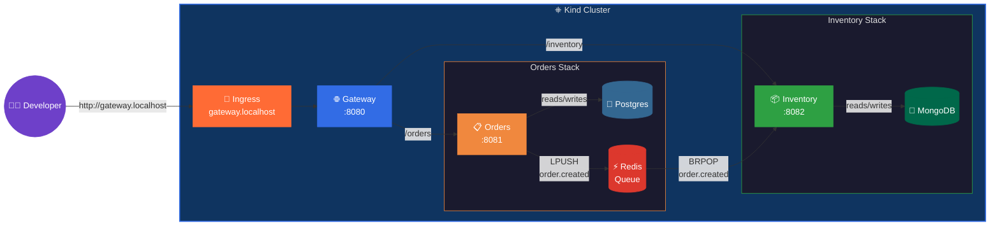

# microservices

A multi-service demo that shows how **kindling** handles a real-ish
microservice architecture — three backend services, a React dashboard,
two databases, and a Redis message queue, all deployed to your local
Kind cluster with zero manual wiring.

## Architecture



### Services

| Service | Port | Database | Description |
|---|---|---|---|
| **ui** | 80 | — | React dashboard. Place orders, view inventory, and watch the activity log in real time. |
| **gateway** | 8080 | — | Public HTTP entry point. Proxies `/orders` and `/inventory` to backend services. |
| **orders** | 8081 | Postgres 16 | Manages orders. Publishes `order.created` events to a Redis queue. |
| **inventory** | 8082 | MongoDB | Manages product stock. Consumes `order.created` events and decrements stock. |

### Data flow

1. `POST /orders` → Gateway forwards to Orders service
2. Orders service inserts a row into Postgres and `LPUSH`es an event onto the `order_events` Redis queue
3. Inventory service's background worker `BRPOP`s the event and decrements the product's stock in MongoDB
4. `GET /inventory` shows the updated stock levels

## What's inside

```
microservices/
├── .github/workflows/
│   └── dev-deploy.yml          # GH Actions: build all 4 images + deploy
├── gateway/
│   ├── main.go                 # Reverse-proxy HTTP server
│   ├── Dockerfile              # Multi-stage build
│   └── go.mod
├── orders/
│   ├── main.go                 # Orders API + Redis queue publisher
│   ├── Dockerfile
│   └── go.mod
├── inventory/
│   ├── main.go                 # Inventory API + Redis queue consumer
│   ├── Dockerfile
│   └── go.mod
├── ui/
│   ├── src/                    # React + TypeScript dashboard
│   ├── Dockerfile              # Vite build → nginx serve
│   ├── nginx.conf.template     # Proxies /api/* → gateway
│   └── package.json
├── deploy/
│   ├── gateway.yaml            # DevStagingEnvironment CR
│   ├── orders.yaml             # DevStagingEnvironment CR (Postgres + Redis)
│   ├── inventory.yaml          # DevStagingEnvironment CR (MongoDB)
│   └── ui.yaml                 # DevStagingEnvironment CR (React UI)
└── README.md                   # ← you are here
```

## Endpoints

### Gateway (`:8080`)

| Method | Path | Description |
|---|---|---|
| `GET` | `/` | Welcome message with route list |
| `GET` | `/healthz` | Liveness probe |
| `GET` | `/status` | Aggregated health of all services |
| `GET` | `/orders` | List recent orders (proxied) |
| `POST` | `/orders` | Create an order (proxied) |
| `GET` | `/inventory` | List product stock levels (proxied) |

### Orders (`:8081`)

| Method | Path | Description |
|---|---|---|
| `GET` | `/healthz` | Liveness probe |
| `GET` | `/status` | Postgres + Redis connectivity |
| `GET` | `/orders` | List orders (newest first, limit 50) |
| `POST` | `/orders` | Create order — `{"product":"widget-a","quantity":2}` |

### Inventory (`:8082`)

| Method | Path | Description |
|---|---|---|
| `GET` | `/healthz` | Liveness probe |
| `GET` | `/status` | MongoDB + Redis connectivity |
| `GET` | `/inventory` | List all products with stock levels |

---

## Quick-start

### Prerequisites

- Local Kind cluster (`kind create cluster --name dev`)
- **kindling** operator deployed ([Getting Started](../../README.md#getting-started))
- `GithubActionRunnerPool` CR applied with your GitHub username

### Option A — Deploy manually (no GitHub push)

```bash
# Build and load images into Kind
docker build -t ms-gateway:dev   gateway/
docker build -t ms-orders:dev    orders/
docker build -t ms-inventory:dev inventory/
docker build -t ms-ui:dev        ui/

kind load docker-image ms-gateway:dev   --name dev
kind load docker-image ms-orders:dev    --name dev
kind load docker-image ms-inventory:dev --name dev
kind load docker-image ms-ui:dev        --name dev

# Apply the DevStagingEnvironment CRs (order matters: deps first)
kubectl apply -f deploy/orders.yaml
kubectl apply -f deploy/inventory.yaml
kubectl apply -f deploy/gateway.yaml
kubectl apply -f deploy/ui.yaml

# Wait for everything to come up
kubectl rollout status deployment/microservices-orders-dev    --timeout=120s
kubectl rollout status deployment/microservices-inventory-dev --timeout=120s
kubectl rollout status deployment/microservices-gateway-dev   --timeout=120s
kubectl rollout status deployment/microservices-ui-dev        --timeout=120s
```

### Option B — Copy into a repo and push

```bash
mkdir my-microservices && cd my-microservices && git init
cp -r /path/to/kindling/examples/microservices/* .
cp -r /path/to/kindling/examples/microservices/.github .

git remote add origin git@github.com:your-org/my-microservices.git
git add -A && git commit -m "initial commit" && git push -u origin main
```

Your local runner picks up the workflow, builds all four images, and
applies the CRs. The kindling operator provisions Postgres, MongoDB,
and Redis automatically.

### Try it out

With ingress-nginx installed (see [setup-ingress.sh](../../setup-ingress.sh)), open
the **React dashboard** — no port-forwarding needed:

```
🎨  http://ui.localhost        ← Dashboard (place orders, view inventory, activity log)
🌐  http://gateway.localhost   ← Gateway API
📋  http://orders.localhost    ← Orders API (direct)
📦  http://inventory.localhost ← Inventory API (direct)
```

Or use curl against the gateway:

```bash
# Check everything is healthy
curl http://gateway.localhost/status | jq .

# Create an order
curl -X POST http://gateway.localhost/orders \
  -H "Content-Type: application/json" \
  -d '{"product":"widget-a","quantity":3}' | jq .

# Wait a moment for the queue consumer, then check inventory
sleep 2
curl http://gateway.localhost/inventory | jq .

# You can also hit the backend services directly for debugging:
curl http://orders.localhost/status | jq .
curl http://inventory.localhost/status | jq .
```

<details>
<summary><strong>Without Ingress (port-forward fallback)</strong></summary>

```bash
kubectl port-forward svc/microservices-gateway-dev 8080:8080
curl localhost:8080/status | jq .
```

</details>

Expected output — `widget-a` stock decremented from 100 → 97:

```json
[
  {"name": "gadget-x",  "stock": 50,  "updated_at": "..."},
  {"name": "widget-a",  "stock": 97,  "updated_at": "..."},
  {"name": "widget-b",  "stock": 250, "updated_at": "..."}
]
```

---

## How the Redis queue works

The orders service and inventory service share a single Redis instance
(provisioned by the orders service's `DevStagingEnvironment`). The
inventory service's CR overrides its `REDIS_URL` env var to point at the
orders service's Redis:

```yaml
# inventory.yaml
spec:
  deployment:
    env:
      - name: REDIS_URL
        value: "redis://microservices-orders-dev-redis:6379/0"
```

The queue protocol is simple:

- **Producer** (orders): `LPUSH order_events <json>`
- **Consumer** (inventory): `BRPOP order_events 2` (blocking pop with 2s timeout)

Event payload:

```json
{
  "event": "order.created",
  "order_id": 1,
  "product": "widget-a",
  "quantity": 3,
  "time": "2026-02-14T12:00:00Z"
}
```

---

## Cleaning up

```bash
kubectl delete devstagingenvironments \
  microservices-ui-dev \
  microservices-gateway-dev \
  microservices-orders-dev \
  microservices-inventory-dev
```

The operator garbage-collects all owned Deployments, Services, and
dependency pods automatically.
