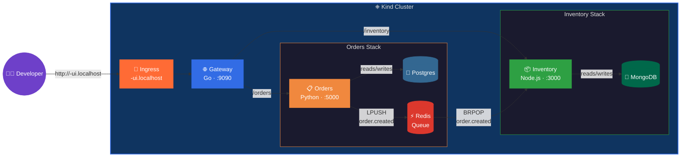

# microservices

A polyglot microservice demo — **Go, Python, and Node.js** — that shows
how **kindling** handles a realistic architecture where each service has
its own language, framework, port, health check path, and env var naming
conventions. Three backend services, a React dashboard, two databases,
and a Redis message queue, all deployed to your local Kind cluster.

Each service is intentionally idiosyncratic — different ports, different
health endpoints, env vars buried in config files, non-standard naming —
to test that `kindling generate` can accurately detect how each app is
configured.

## Architecture



### Services

| Service | Language | Port | Health path | Database | Quirks |
|---|---|---|---|---|---|
| **ui** | TypeScript (React) | 80 | `/` | — | Vite build → nginx. Standard. |
| **gateway** | Go (stdlib) | 9090 | `/-/ready` | — | Config in separate `config.go`. Port via `LISTEN_ADDR`. Upstreams via `ORDERS_URL` / `INVENTORY_URL`. |
| **orders** | Python (FastAPI) | 5000 | `/api/v1/health` | Postgres 16 | Config class in `config.py`. Postgres via `PG_DSN`. Redis via `QUEUE_URL`. Pydantic models. |
| **inventory** | Node.js (Fastify) | 3000 | `/healthcheck` | MongoDB | Config in `config.js`. Port hardcoded. Mongo via `MONGODB_URI`. Redis via `EVENT_STORE_URL`. |

### Data flow

1. `POST /orders` → Gateway forwards to Orders service
2. Orders inserts a row into Postgres and `LPUSH`es an event onto the `order_events` Redis queue
3. Inventory's background worker `BRPOP`s the event and decrements stock in MongoDB
4. `GET /inventory` shows the updated stock levels

## Files

```
microservices/
├── .github/workflows/
│   └── dev-deploy.yml          # GitHub Actions workflow (uses kindling actions)
├── gateway/                    # Go (stdlib)
│   ├── main.go                 # Reverse-proxy HTTP server
│   ├── config.go               # Config struct — reads LISTEN_ADDR, ORDERS_URL, INVENTORY_URL
│   ├── Dockerfile
│   └── go.mod
├── orders/                     # Python (FastAPI)
│   ├── main.py                 # Routes — POST/GET /orders, GET /api/v1/health
│   ├── config.py               # Settings class — reads APP_PORT, PG_DSN, QUEUE_URL
│   ├── db.py                   # Postgres helpers (psycopg2)
│   ├── queue.py                # Redis event publisher
│   ├── requirements.txt
│   └── Dockerfile
├── inventory/                  # Node.js (Fastify)
│   ├── server.js               # Fastify app — /inventory, /healthcheck
│   ├── config.js               # Reads MONGODB_URI, EVENT_STORE_URL; hardcodes port 3000
│   ├── package.json
│   └── Dockerfile
├── ui/                         # TypeScript (React + Vite)
│   ├── src/                    # React dashboard
│   ├── Dockerfile              # Vite build → nginx serve
│   ├── nginx.conf.template
│   └── package.json
├── deploy/                     # DevStagingEnvironment CRs (for manual deploy)
│   ├── orders.yaml
│   ├── inventory.yaml
│   ├── gateway.yaml
│   └── ui.yaml
└── README.md
```

### Why the env vars are different

Each service uses its own naming convention — this is realistic for teams
where different developers (or even different companies) wrote each service:

| What | Operator injects | Gateway reads | Orders reads | Inventory reads |
|---|---|---|---|---|
| Postgres DSN | `DATABASE_URL` | — | `PG_DSN` | — |
| Redis URL | `REDIS_URL` | — | `QUEUE_URL` | `EVENT_STORE_URL` |
| MongoDB URL | `MONGO_URL` | — | — | `MONGODB_URI` |
| Orders upstream | — | `ORDERS_URL` | — | — |
| Inventory upstream | — | `INVENTORY_URL` | — | — |

The deploy YAMLs bridge the gap with env var mappings (e.g. `PG_DSN: $(DATABASE_URL)`).

## GitHub Actions Workflow

The included workflow uses the **reusable kindling actions** — each
build step is a single `uses:` call:

```yaml
# Simplified — see .github/workflows/dev-deploy.yml for the full file
steps:
  - uses: actions/checkout@v4

  - name: Build orders
    uses: jeff-vincent/kindling/.github/actions/kindling-build@main
    with:
      name: ms-orders
      context: "${{ github.workspace }}/orders"
      image: "registry:5000/ms-orders:${{ env.TAG }}"

  # ... inventory, gateway, ui ...

  - name: Deploy orders
    uses: jeff-vincent/kindling/.github/actions/kindling-deploy@main
    with:
      name: "${{ github.actor }}-orders"
      image: "registry:5000/ms-orders:${{ env.TAG }}"
      port: "5000"
      health-check-path: "/api/v1/health"
      env: |
        - name: PG_DSN
          value: "$(DATABASE_URL)"
        - name: QUEUE_URL
          value: "$(REDIS_URL)"
      dependencies: |
        - type: postgres
          version: "16"
        - type: redis
```

## Quick-start

### Prerequisites

- Local Kind cluster with **kindling** operator deployed ([Getting Started](../../README.md#getting-started))
- `GithubActionRunnerPool` CR applied with your GitHub username

### Option A — Push to GitHub (recommended)

```bash
mkdir my-microservices && cd my-microservices && git init
cp -r /path/to/kindling/examples/microservices/* .
cp -r /path/to/kindling/examples/microservices/.github .

git remote add origin git@github.com:you/my-microservices.git
git add -A && git commit -m "initial commit" && git push -u origin main
```

The runner builds all four images via Kaniko, pushes to `registry:5000`,
and the operator provisions Postgres, MongoDB, and Redis automatically.

### Option B — Deploy manually

```bash
for svc in gateway orders inventory ui; do
  docker build -t registry:5000/ms-${svc}:dev examples/microservices/${svc}/
  kind load docker-image registry:5000/ms-${svc}:dev --name dev
done

kubectl apply -f examples/microservices/deploy/
```

### Try it out

```bash
# Open the React dashboard
open http://<your-username>-ui.localhost

# Or hit the API directly
curl http://<your-username>-gateway.localhost/-/status | jq .

# Create an order
curl -X POST http://<your-username>-gateway.localhost/orders \
  -H "Content-Type: application/json" \
  -d '{"product":"widget-a","quantity":3}' | jq .

# Check inventory (stock decremented via Redis queue)
sleep 2
curl http://<your-username>-gateway.localhost/inventory | jq .
```

### Redis queue details

The orders and inventory services share a single Redis instance
(provisioned by orders' `DevStagingEnvironment`). Inventory's deploy
maps the shared Redis URL to its own env var name:

```yaml
env:
  - name: EVENT_STORE_URL
    value: "redis://<username>-orders-redis:6379/0"
```

Protocol: `LPUSH order_events <json>` / `BRPOP order_events 0`

## Cleaning up

```bash
kubectl delete devstagingenvironments -l app.kubernetes.io/part-of=microservices-demo
```
