# platform-api

A Go web server + React dashboard that demonstrates **kindling** with
five backing services — all auto-provisioned by the operator. The API
connects to PostgreSQL, Redis, Elasticsearch, Kafka, and Vault; the
dashboard gives you a real-time view of every service's health.

## Architecture

```mermaid
flowchart LR
    user(("👩‍💻 Developer"))

    subgraph cluster["⎈  Kind Cluster"]
        ui["🖥️ platform-ui\n:80\n<i>React + nginx</i>"]
        api["🔷 platform-api\n:8080\n<i>Go</i>"]

        pg[("🐘 Postgres 16")]
        rd[("⚡ Redis")]
        es[("🔍 Elasticsearch")]
        kafka[("📨 Kafka")]
        vault[("🔐 Vault")]

        ui -- "/api/*" --> api
        api --> pg
        api --> rd
        api --> es
        api --> kafka
        api --> vault
    end

    user -- "http://<user>-platform-ui.localhost" --> ui
    user -. "http://<user>-platform-api.localhost" .-> api

    style cluster fill:#0f3460,stroke:#326CE5,color:#e0e0e0,stroke-width:2px
    style ui fill:#6e40c9,stroke:#6e40c9,color:#fff
    style api fill:#326CE5,stroke:#326CE5,color:#fff
    style pg fill:#336791,stroke:#336791,color:#fff
    style rd fill:#DC382D,stroke:#DC382D,color:#fff
    style es fill:#FEC514,stroke:#FEC514,color:#000
    style kafka fill:#231F20,stroke:#231F20,color:#fff
    style vault fill:#000,stroke:#FFCB2D,color:#FFCB2D
    style user fill:#6e40c9,stroke:#6e40c9,color:#fff
```



## What you get

| URL | Description |
|---|---|
| `http://<user>-platform-ui.localhost` | 🖥️ **Dashboard** — live status of all 5 services |
| `http://<user>-platform-api.localhost/` | API hello message |
| `http://<user>-platform-api.localhost/healthz` | Liveness probe |
| `http://<user>-platform-api.localhost/status` | Raw JSON — pings all 5 deps |

The dashboard auto-refreshes every 5 seconds and shows:
- Status cards for each service with connection details
- Per-service uptime sparklines
- Event log tracking connect/disconnect state changes

## Files

```
platform-api/
├── .github/workflows/
│   └── dev-deploy.yml             # GitHub Actions workflow (uses kindling actions)
├── main.go                        # Go API (~210 lines)
├── Dockerfile                     # Two-stage build (golang → alpine)
├── go.mod
├── dev-environment.yaml           # 2 DevStagingEnvironment CRs
├── ui/
│   ├── src/
│   │   ├── App.tsx                # React dashboard component
│   │   ├── App.css                # Dark theme styles
│   │   └── main.tsx               # Entry point
│   ├── Dockerfile                 # node:20 → nginx:1.25
│   ├── nginx.conf.template        # Proxies /api/* → platform-api
│   ├── entrypoint.sh              # envsubst for API_URL
│   ├── package.json
│   ├── tsconfig.json
│   └── vite.config.ts
└── README.md
```

## GitHub Actions Workflow

The included workflow uses the **reusable kindling actions** — two
builds and two deploys in ~100 lines:

```yaml
# Simplified — see .github/workflows/dev-deploy.yml for the full file
steps:
  - uses: actions/checkout@v4

  - name: Clean builds directory
    run: rm -f /builds/*

  # Build both images
  - name: Build API
    uses: kindling-sh/kindling/.github/actions/kindling-build@main
    with:
      name: platform-api
      context: ${{ github.workspace }}
      image: "registry:5000/platform-api:${{ env.TAG }}"
      exclude: "./ui"

  - name: Build UI
    uses: kindling-sh/kindling/.github/actions/kindling-build@main
    with:
      name: platform-api-ui
      context: "${{ github.workspace }}/ui"
      image: "registry:5000/platform-api-ui:${{ env.TAG }}"

  # Deploy with 5 dependencies — the operator handles all of them
  - name: Deploy API
    uses: kindling-sh/kindling/.github/actions/kindling-deploy@main
    with:
      name: "${{ github.actor }}-platform-api"
      image: "registry:5000/platform-api:${{ env.TAG }}"
      port: "8080"
      ingress-host: "${{ github.actor }}-platform-api.localhost"
      dependencies: |
        - type: postgres
          version: "16"
        - type: redis
        - type: elasticsearch
        - type: kafka
        - type: vault

  - name: Deploy UI
    uses: kindling-sh/kindling/.github/actions/kindling-deploy@main
    with:
      name: "${{ github.actor }}-platform-api-ui"
      image: "registry:5000/platform-api-ui:${{ env.TAG }}"
      port: "80"
      health-check-path: "/"
      env: |
        - name: API_URL
          value: "http://${{ github.actor }}-platform-api:8080"
      ingress-host: "${{ github.actor }}-platform-ui.localhost"
```

## Quick-start

### Prerequisites

- Local Kind cluster with **kindling** operator deployed ([Getting Started](../../README.md#getting-started))
- `GithubActionRunnerPool` CR applied with your GitHub username

### Option A — Push to GitHub (CI flow)

```bash
mkdir my-platform && cd my-platform && git init
cp -r /path/to/kindling/examples/platform-api/* .
cp -r /path/to/kindling/examples/platform-api/.github .

git remote add origin git@github.com:you/my-platform.git
git add -A && git commit -m "initial commit" && git push -u origin main
```

### Option B — Deploy manually

```bash
docker build -t platform-api:dev examples/platform-api/
docker build -t platform-api-ui:dev examples/platform-api/ui/
kind load docker-image platform-api:dev --name dev
kind load docker-image platform-api-ui:dev --name dev
kubectl apply -f examples/platform-api/dev-environment.yaml
kubectl rollout status deployment/platform-api-dev --timeout=180s
```

### Try it out

```bash
# Open the dashboard
open http://<user>-platform-ui.localhost

# Or hit the API
curl http://<user>-platform-api.localhost/status | jq .
```

Expected `/status` output:

```json
{
  "app": "platform-api",
  "time": "2026-02-15T12:00:00Z",
  "postgres": { "status": "connected" },
  "redis": { "status": "connected" },
  "elasticsearch": { "status": "connected", "version": "8.12.0" },
  "kafka": { "status": "connected", "brokers": "1" },
  "vault": { "status": "connected", "sealed": "false", "version": "1.15.4" }
}
```

## What the operator creates

When you apply the two `DevStagingEnvironment` CRs, the kindling operator
auto-provisions **11 Kubernetes resources** from two small YAML blocks:

| Resource | Description |
|---|---|
| **API Deployment** | Go API container with health checks |
| **API Service + Ingress** | `<user>-platform-api.localhost` |
| **UI Deployment** | nginx serving the React SPA |
| **UI Service + Ingress** | `<user>-platform-ui.localhost` |
| **Postgres 16** | Pod + Service, `DATABASE_URL` injected |
| **Redis** | Pod + Service, `REDIS_URL` injected |
| **Elasticsearch** | Pod + Service, `ELASTICSEARCH_URL` injected |
| **Kafka** (KRaft) | Pod + Service, `KAFKA_BROKER_URL` injected |
| **Vault** (dev) | Pod + Service, `VAULT_ADDR` + `VAULT_TOKEN` injected |

## Local UI development

```bash
cd examples/platform-api && go run .
cd examples/platform-api/ui && npm install && npm run dev
```

Vite proxies `/api/*` to `localhost:8080` — see `vite.config.ts`.

## Cleaning up

```bash
kubectl delete devstagingenvironment <user>-platform-api <user>-platform-api-ui
```
